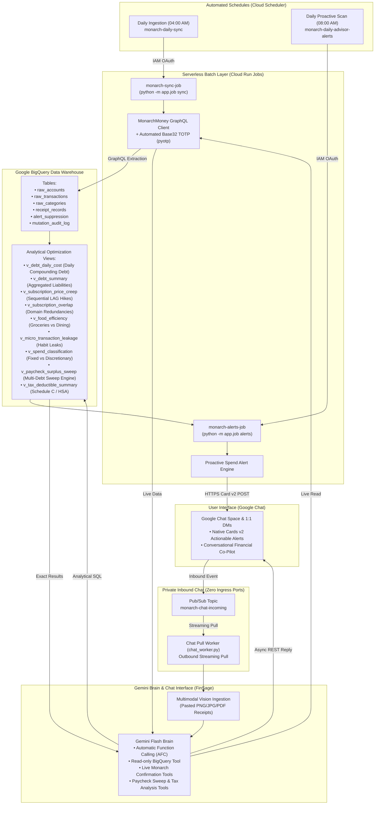

# FinSage: Family Financial Intelligence Hub
**Automated Personal Finance, Cash Flow & Debt Acceleration Hub via Monarch Money, Google BigQuery & Gemini Flash**

[](https://www.python.org/)
[](https://fastapi.tiangolo.com/)
[](https://cloud.google.com/)
[](https://cloud.google.com/bigquery)
[](https://deepmind.google/technologies/gemini/)
[](https://www.terraform.io/)
[](tests/)
[](LICENSE)

<p align="center">
  
</p>

An enterprise-grade, serverless family financial advisor, cash flow coordinator, and debt acceleration engine deployed to **Google Cloud Platform**. It bridges **Monarch Money** directly into **Google BigQuery** data warehouse models, powered by an autonomous, bidirectional **Google Chat Co-Pilot (FinSage)** running **Gemini Flash** with **Automatic Function Calling (AFC)**, **Multimodal Vision**, and **Long-Term Memory**.

---

## 📚 Documentation Index

FinSage documentation is broken out into dedicated guides:

| Guide | Description |
| :--- | :--- |
| **[BigQuery Analytical Views](docs/analytical-views.md)** | Deep dive into the 18+ BigQuery models: daily debt carry math, subscription price creep, grocery-to-dining ratios, and paycheck sweep algorithms. |
| **[Google Chat Financial Advisor](docs/chat-advisor.md)** | FinSage bot architecture, slash command reference (`/brief`, `/sweep`, `/tax`, `/digest`), multimodal receipt ingestion, and guarded mutations. |
| **[Configuration & Custom Rates](docs/configuration.md)** | Setting baseline APRs (Mortgage, HELOC, Loans), account overrides, decommissioned accounts, and Secret Manager resolution. |
| **[Deployment & Operations](docs/deployment.md)** | Step-by-step setup with Terraform, Google Cloud Build, Cloud Run Jobs, Cloud Scheduler, and zero-ingress Pub/Sub configuration. |

---

## Core Engineering Highlights

* **Deterministic Arithmetic over Hallucination**: AI models are prone to arithmetic errors. All financial calculations—daily compounding debt carry across mortgages and HELOCs, subscription price creep, dining efficiency ratios, and paycheck surplus sweeps—are executed deterministically in BigQuery SQL views. Gemini queries these views via read-only tools to ground recommendations in exact arithmetic.
* **Paycheck Surplus Sweep & Debt Acceleration**: Automatically models 30-day fixed overhead burn baselines plus upcoming lump-sum bills. When payroll deposits land, FinSage calculates safe checking reserves and computes the exact sweep amount to pay down high-carry debt, reporting daily, monthly, and annual compound interest saved.
* **Multimodal Vision & Tax Ingestion**: Paste receipts or invoices directly into Google Chat. Gemini Vision extracts itemized lines, scrubs sensitive PII (SSN, EIN, card numbers), categorizes tax deductibility (Schedule C, HSA/FSA, Charities), and asymmetrically matches against posted bank debits with tip authorization handling.
* **Guarded Mutations & Cryptographic Confirmation**: When modifying transaction categories or updating records, FinSage requires physical confirmation via interactive Google Chat Cards v2 with HMAC-SHA256 tokens and an append-only BigQuery audit trail.
* **Zero-Ingress Perimeter Security**: Cloud Run runs with `--ingress internal` and receives chat events exclusively through an asynchronous **Google Cloud Pub/Sub** streaming pull worker (`app/chat_worker.py`). The microservice opens connections outward and exposes zero listening ports to the public internet.
* **Always-Free Tier Efficiency**: Operates entirely within Google Cloud's **Always Free Tier** (~**$0.37 / month** total infrastructure cost).

---

## Architectural Workflow (Zero-Ingress Posture)



---

## Google Chat Commands Cheatsheet

| Command | Action | Primary Model / Tool |
| :--- | :--- | :--- |
| **`/brief`** or **`/alerts`** | Renders morning financial synopsis and active spend alerts. | `v_debt_summary`, `v_spend_classification` |
| **`/sweep`** | Computes safe paycheck surplus to sweep to high-rate variable debt. | `v_paycheck_surplus_allocation` |
| **`/tax [YYYY]`** | Displays annual tax deductibility summary (Schedule C, HSA, Charities). | `v_tax_deductible_summary` |
| **`/digest [weekly\|monthly]`** | Generates an executive CFO performance briefing. | `v_debt_summary`, `v_spend_classification` |
| **`/sync`** | Triggers immediate Monarch Money ingestion into BigQuery. | `monarch_service.sync_accounts_to_bq()` |
| **`/receipt`** *(with attachment)* | Extracts and logs receipt with IRS tax classification and bank match. | Gemini Vision, `raw_transactions` |
| **`/help`** | Displays quick command reference and usage examples. | Built-in |

---

## Quickstart (2-Minute Local Setup)

```bash
# 1. Clone repository and install dependencies
git clone https://github.com/n0012/family-financial-intelligence-hub.git
cd family-financial-intelligence-hub
python3 -m venv .venv && source .venv/bin/activate
pip install -r requirements.txt -r requirements-dev.txt

# 2. Configure credentials & custom interest rates
cp .env.example .env.local
cp config.example.yaml config.yaml

# 3. Run automated test suite
PYTHONPATH=. ./.venv/bin/pytest -v
```

For complete deployment instructions, see the **[Deployment & Operations Guide](docs/deployment.md)**.

---

## License & Acknowledgments

This project is licensed under the [MIT License](LICENSE).

Inspirations & libraries:
* [Concept and Architecture Reference](https://chatgpt.com/share/69f7d4a5-a8e4-83ea-b6e2-78fb8eb79339)
* [`hammem/monarchmoney`](https://github.com/hammem/monarchmoney) — Python client library for Monarch Money.
* [`6missedcalls/personal-finance-skill`](https://github.com/6missedcalls/personal-finance-skill) — Multi-tier policy guardrails, FRED macro-economic grounding, and IRS tax classification schemas.
