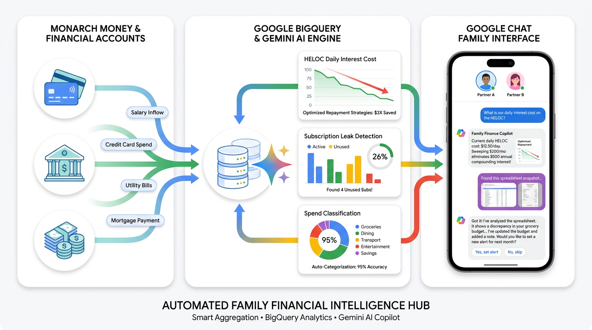
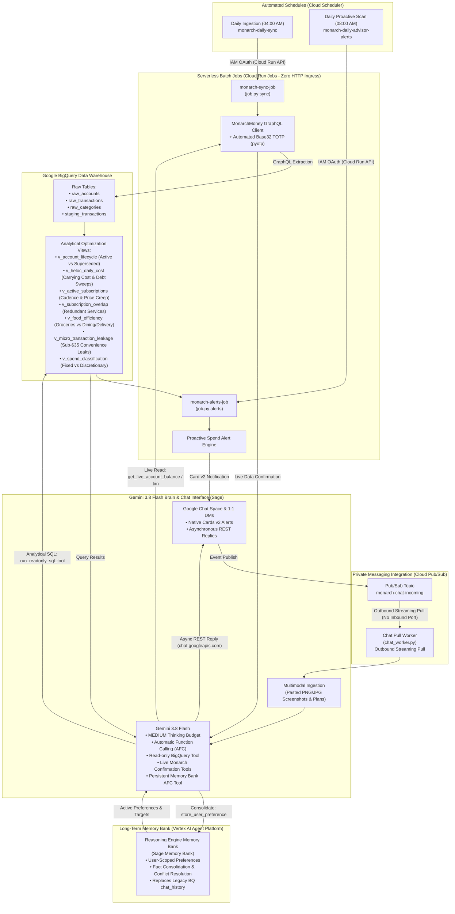

# Family Financial Intelligence Hub
**Automated Personal Finance & Spend Optimization via Monarch Money, Google BigQuery & Gemini 3.8 Flash**

[](https://www.python.org/)
[](https://fastapi.tiangolo.com/)
[](https://cloud.google.com/)
[](https://cloud.google.com/bigquery)
[](https://deepmind.google/technologies/gemini/)
[](https://www.terraform.io/)
[](https://opensource.org/licenses/MIT)

<p align="center">
  
</p>

An enterprise-grade, serverless family financial advisor and spend optimization hub deployed to **Google Cloud Platform**. It bridges **Monarch Money**'s GraphQL API directly into **Google BigQuery** data warehouse models, powered by a bidirectional **Google Chat Advisor (Sage)** running **Gemini 3.8 Flash** with **Automatic Function Calling (AFC)** and **Multimodal Vision**.

---

## Executive Summary & Engineering Highlights

Traditional personal finance tools (Monarch, Mint, YNAB) excel at aggregating transactions and basic budgeting, but lack proactive quantitative reasoning, debt paydown acceleration mathematics, and conversational interfaces. 

This project transforms raw personal finance data into a continuous, intelligent financial advisor:

* **Deterministic Arithmetic over Hallucination**: AI models are notoriously prone to arithmetic mistakes when performing math on financial figures. Here, all financial logic—daily compounding interest, subscription price creep, grocery-to-dining ratios, and micro-transaction leakage—is modeled directly in BigQuery GoogleSQL analytical views. Gemini queries these views via live read-only tools to ground every recommendation in deterministic arithmetic.
* **Multimodal Vision in Google Chat**: Users can paste screenshots of spreadsheets, brokerage accounts, paystubs, or compensation outlook plans directly into Google Chat. Gemini 3.8 Flash parses the visual layout, extracts line items and dates, and correlates them against live bank balances in BigQuery.
* **Lifecycle & Migration Intelligence**: Automatically detects active vs legacy/superseded accounts across banking mergers, account upgrades, and credit card replacements without hardcoded account IDs.
* **Idempotent Ingestion & Deduplication**: High-performance pagination pulls transactions from Monarch Money into staging tables and executes atomic SQL `MERGE` operations, preventing duplicate entries across repeated syncs.
* **Serverless Cost Efficiency**: Operates entirely within Google Cloud's **Always Free Tier** (~**$0.37 / month** total infrastructure cost).

---

## Architectural Workflow (Zero-Ingress Posture)



---

## BigQuery Data Model & Analytical Views

The data warehouse decouples storage from analytical modeling, allowing queries to run instantaneously across years of transaction history:

| View / Table | Description & Optimization Logic |
| :--- | :--- |
| **`raw_accounts`** | Active balances, credit limits, reported interest rates, and institution metadata. |
| **`raw_transactions`** | Deduplicated, sanitized transaction stream with merchant categorization. |
| **`raw_categories`** | Budget envelopes grouped into Fixed Overhead, Discretionary, Debt, and Income. |
| **`v_account_lifecycle`** | Dynamically classifies accounts as `PRIMARY` vs `SUPERSEDED` based on activity recency, non-zero balance, and transaction count. Resolves duplicate accounts during bank mergers. |
| **`v_heloc_daily_cost`** | Computes the exact daily compounding cost (`(balance * apr) / 365`) and monthly carrying cost of variable-rate debt, alongside payoff acceleration impacts. |
| **`v_active_subscriptions`** | Autodetects recurring billing cadences (monthly, quarterly, annual), projects annual run-rates, and flags **price creep** by comparing average vs maximum historical charges. |
| **`v_subscription_overlap`** | Aggregates concurrent active subscriptions within the same category (e.g. streaming, cloud storage, fitness) to highlight redundancy. |
| **`v_food_efficiency`** | Calculates the monthly ratio between grocery purchases and dining out / food delivery markups (DoorDash, UberEats, Grubhub). |
| **`v_micro_transaction_leakage`** | Flags frequent sub-$35 convenience transactions (coffee shops, convenience stores, app purchases) and calculates their annualized drain. |
| **`v_spend_classification`** | Classifies all monthly outflows into Fixed Overhead vs Discretionary spend to evaluate baseline burn rate. |

---

## Interactive Google Chat Advisor (Sage)

The microservice functions as a registered **Google Chat Bot** supporting both 1:1 direct messages and collaborative family spaces:

### 1. Conversational Queries & Multi-Turn Reasoning
Ask complex financial questions in natural language. Gemini selects the appropriate analytical view, runs the query, and synthesizes actionable recommendations:
* *"What is our daily interest cost on the HELOC right now?"*
* *"Which subscriptions increased in price over the last year?"*
* *"How much did we spend on dining out vs groceries last month?"*
* *"Where are our top micro-transaction leaks under $35?"*
* *"If we redirect $500/month from discretionary spending to debt paydown, how much interest do we eliminate?"*

### 2. Multimodal Vision Analysis (Screenshots & Projections)
Paste images directly into Google Chat:
* **Outlook & Compensation Tables**: Paste a screenshot of an annual compensation breakdown or bonus projection. The bot extracts base salary, bonuses, and equity vesting dates, then models optimal tax withholding and debt-payoff allocation.
* **External Brokerage / Loan Statements**: Paste a PDF or PNG statement from an unlinked institution. Gemini extracts balances, interest rates, and minimum payments to incorporate into your debt snow-ball calculations.

### 3. Chat Commands & Shortcuts
* `/sync` — Pulls latest transactions from Monarch Money into BigQuery immediately.
* `/alerts` — Triggers an on-demand scan across all BigQuery optimization views and posts the alert summary.
* `/help` — Displays quick reference guides and sample prompts.

---

## Repository Structure

```
family-financial-intelligence-hub/
├── main.py                     # FastAPI application & Google Chat webhook router
├── bq_service.py               # BigQuery SQL query tool, analytical views & schema migration
├── monarch_service.py          # MonarchMoney client auth, sync pipelines & live confirmation tools
├── memory_service.py           # Vertex AI Agent Platform Memory Bank client & user preference tools
├── job.py                      # Cloud Run Job CLI entrypoint (sync & alerts batch runner)
├── chat_worker.py              # Zero-ingress Google Chat Pub/Sub pull subscriber
├── config.py                   # Centralized configuration, local overrides, & secret caching
├── alerts.py                   # Proactive spend anomaly alert engine & Google Chat Card v2 builder
├── schema.sql                  # BigQuery schema definitions & analytical optimization views
├── Dockerfile                  # Production container definition (Python 3.11-slim)
├── cloudbuild.yaml             # Google Cloud Build CI/CD pipeline definition
├── deploy.sh                   # Hardened zero-ingress deployment script
├── bootstrap_gcp_project.sh    # Initial GCP project bootstrapping & IAM automation
├── config.example.yaml         # YAML configuration template (rates, account overrides, exclusions)
├── config.example.json         # JSON configuration template
├── sync_secrets_to_gcp.sh      # Automated secret synchronization from .env.local to Secret Manager
├── create_ca_agent.py          # Google Cloud Conversational Analytics Agent deployment script
├── requirements.txt            # Python dependencies (includes google-cloud-aiplatform)
├── requirements-dev.txt        # Optional test & development dependencies
├── .env.example                # Template for environment configuration
├── tests/                      # Pytest automated test suite (62 passing unit tests)
│   ├── test_alerts_and_config.py # Config caching, token auth, Card v2 builders, job CLI
│   ├── test_bq_service.py        # Read-only SQL safety guards, CA fallback, in-memory session history
│   ├── test_monarch_service.py   # Monarch auth, sync pipelines, live read tools, rate limits
│   ├── test_monarch_mutations.py # HMAC signatures, guarded mutations, Card v2 interactive actions
│   └── test_memory_service.py    # Vertex AI Memory Bank retrieval, prompt formatting, fact consolidation
└── terraform/                  # Infrastructure as Code (Terraform / OpenTofu)
    ├── main.tf                 # BigQuery, Artifact Registry, Pub/Sub, Cloud Scheduler, IAM
    ├── variables.tf            # Configurable deployment variables
    ├── outputs.tf              # Pub/Sub topics, subscriptions, and dataset outputs
    └── terraform.tfvars.example # Example variable values
```

---

## Incremental Architecture & PR Changelog

To ensure modularity, maintainability, and test coverage, the system is refactored incrementally across targeted Pull Requests:

### **PR 1: Modular Config, Spend Alerts & Unified Job CLI**
* **Extracted [`config.py`](config.py)**: Centralized hierarchical configuration resolution. Added local JSON/YAML file overrides (`config.yaml`/`config.json`), Secret Manager client caching with in-memory fallback to environment variables, debt APR defaults, account exclusion rules, and institution name overrides.
* **Extracted [`alerts.py`](alerts.py)**: Isolated the autonomous Spend Optimization Advisor scan engine. Implemented rich Google Chat **Card v2** formatting with styled headers, metrics, and actionable recommendations, complete with resilient markdown fallbacks.
* **Implemented [`job.py`](job.py)**: Unified CLI runner for Cloud Run Jobs (`job.py sync` and `job.py alerts`). Cleanly decoupled scheduled batch tasks from the HTTP server lifecycle.
* **Test Suite**: Introduced unit test coverage in [`tests/test_alerts_and_config.py`](tests/test_alerts_and_config.py) for configurations, card generation, and job execution.

### **PR 1.5: Zero-Ingress Perimeter Security & Google Workspace Add-on Authentication**
* **Zero-Ingress Pull Worker ([`chat_worker.py`](chat_worker.py))**: Hardened Cloud Run with `--ingress internal` and embedded an asynchronous Pub/Sub streaming pull worker that connects outbound to `monarch-chat-sub`, eliminating all public listening HTTP ports.
* **IAM & Service Agent Hardening**: Configured Pub/Sub IAM publisher bindings for both `chat-api-push@system.gserviceaccount.com` (direct Chat API) and `service-475933066321@gcp-sa-gsuiteaddons.iam.gserviceaccount.com` (Google Workspace Add-on runtime).
* **Cryptographic Token Verification**: Added Google OAuth Bearer token signature and audience validation, strictly verifying Google-issued service account tokens.
* **Persona & Branding Rebrand**: Rebranded the assistant persona to **Sage** across all greetings, Card v2 headers, slash command help text, mention stripper regexes, and public CDN avatar hosting.

### **PR 2: Modular Monarch Service & Real-Time Confirmation Read Tools**
* **Extracted [`monarch_service.py`](monarch_service.py)**: Moved MonarchMoney GraphQL client session management, TOTP 2FA resolution, and BigQuery data pipeline (`sync_all_accounts`, `sync_all_categories`, `sync_transactions`, `execute_sync`) out of `main.py`, shrinking `main.py` by over 320 lines.
* **Live Confirmation Read Tools for Gemini AFC**:
  * `get_live_account_balance(account_identifier)`: Queries up-to-the-minute balances directly from Monarch Money when users ask for real-time verification (e.g., *"Did my paycheck post?"* or *"What is my live HELOC balance?"*).
  * `get_live_transaction(transaction_id)`: Inspects individual transaction details, notes, and pending states directly from Monarch.
  * `request_plaid_refresh(institution_name)`: Triggers on-demand aggregator refresh for a connected bank, protected by an in-memory **60-minute rate-limiting cooldown** per institution to prevent account lockouts.
* **Unit Test Coverage ([`tests/test_monarch_service.py`](tests/test_monarch_service.py))**: 28 passing unit tests across the repository verifying login, sync ingestion, live read tools, and cooldown guards.
* **Production Deployment**: Shipped container revision `monarch-gemini-wrapper-00052-lfw` live to Cloud Run with zero ingress.

### **PR 3: BigQuery Storage & Analytical Views Service ([`bq_service.py`](bq_service.py))**
* **Extracted [`bq_service.py`](bq_service.py)**: Modularized BigQuery client instantiation, query execution, and session management out of `main.py`, reducing `main.py` down to 807 lines (a 515+ line overall reduction).
* **Read-Only SQL Safety Engine (`run_readonly_sql`)**: Strictly enforces word-boundary regex blocks against mutating DDL/DML keywords (`insert`, `update`, `delete`, `drop`, `truncate`, `alter`, `create`, `merge`, `grant`, `revoke`) and limits query billing scan budgets to 100 MB.
* **Conversational Analytics Integration (`ask_conversational_analytics`)**: Isolated fallback agent dispatching to Gemini Conversational Analytics with project resolution.
* **Chat History Persistence & Hydration**:
  * Dual-layer caching: in-memory LRU/dict thread and space histories for lightning-fast multi-turn replies within active containers.
* **BigQuery Schema Migration (`apply_bigquery_schema`)**: Added programmatic application helper for `schema.sql` tables and analytical views.
* **Full Unit Test Coverage ([`tests/test_bq_service.py`](tests/test_bq_service.py))**: Added 11 new tests, raising total suite to 39 passing tests.

### **PR 4: Carefully Guarded Monarch Mutations & Interactive Card v2 Confirmation**
* **HMAC-SHA256 Cryptographic Signing & Verification**:
  * Implemented `generate_mutation_signature` and `verify_mutation_signature` using high-entropy secrets and constant-time comparison (`hmac.compare_digest`).
  * Cryptographically binds `transaction_id`, `category_id`, `user_email`, and UNIX timestamp with a strict **15-minute expiration window** (`HMAC_EXPIRATION_SECONDS = 900`) to prevent replay or parameter tampering.
* **Category Resolution & In-Memory Caching (`resolve_category`)**:
  * High-performance dual-tier resolution: reads from BigQuery `family_finance.raw_categories` fast-path with fallback to MonarchMoney API.
  * Multi-strategy matching: exact UUID match, case-insensitive name match, alphanumeric-normalized match, and substring search.
* **Guarded Tool Definition (`propose_transaction_recategorization`)**:
  * **Strict Single-Transaction Limit**: Blocks bulk IDs, commas, arrays, or whitespace-separated arguments to prevent accidental mass modifications.
  * **Pending Transaction Refusal**: Checks real-time transaction state via `get_live_transaction_async` and refuses to recategorize pending/unsettled transactions.
  * Thread-safe ContextVar (`CURRENT_PROPOSED_CARD`, `CURRENT_USER_EMAIL`) passes confirmation cards directly to Google Chat message assembly.
* **Interactive Google Chat Card v2 Confirmation Pipeline**:
  * Renders interactive **Card v2** widgets with formatted merchant, amount, date, current category, proposed category, and "Confirm Update" / "Cancel" action buttons.
  * Webhook handles `CARD_CLICKED` events, validates signature freshness and authenticity, calls `execute_guarded_recategorization`, synchronizes BigQuery `raw_transactions` in-place, and returns a rich success card.
* **Full Unit Test Coverage ([`tests/test_monarch_mutations.py`](tests/test_monarch_mutations.py))**: Added 12 new unit tests, bringing the total suite to **51 passing unit tests** across the codebase.

### **PR 5: Vertex AI Agent Platform Memory Bank & BigQuery `chat_history` Retirement**
* **Extracted [`memory_service.py`](memory_service.py)**: Built client integration with Google Cloud's **Vertex AI Agent Platform Reasoning Engine Memory Bank** (`Sage Memory Bank` on `us-central1`).
* **Semantic Fact Extraction & Automatic Consolidation**: Uses foundation model embeddings (`text-embedding-005`) to automatically update, consolidate, and resolve conflicting facts in-place without manual deduplication.
* **User-Scoped Memory Bank**: Memory retrieval and updates are dynamically anchored to the authenticated user's email (`nick@sagelycreations.com`) via thread-safe `ContextVar`.
* **Gemini AFC Tool (`store_user_preference`)**: Equips Gemini 3.8 Flash to autonomously persist explicit goals, discretionary spending limits, debt payoff milestones, and alerts on the fly during natural conversation.
* **Retired BigQuery `chat_history`**: Completely eliminated writes and queries to BigQuery `family_finance.chat_history` table in favor of native Memory Bank facts, while retaining ultra-low-latency in-memory LRU caching strictly for intra-turn multi-turn pronoun tracking.
* **Full Unit Test Coverage ([`tests/test_memory_service.py`](tests/test_memory_service.py))**: Added 11 new unit tests covering client authentication, email resolution, prompt block formatting, fact generation, and error fallback, bringing the repository suite to **62 passing unit tests**.

### **Upcoming Roadmap (PR 6)**
* **PR 6: Autonomous Spend Anomaly Alerts & Suppression Rules**: Dynamic multi-table anomaly scan alerting with exact-match suppression table in BigQuery.


---

## Configuration & Custom Rates

You can configure custom interest rates (e.g. variable-rate HELOCs), manual account overrides, and bank exclusions using a local configuration file (`config.yaml` or `config.json`), or through Google Cloud Secret Manager / environment variables:

```bash
cp config.example.yaml config.yaml
```

```yaml
# config.yaml (gitignored - safe for private local use)
rates:
  default_heloc_apr: 0.0675          # Default APR for HELOCs (6.75%)
  default_mortgage_apr: 0.0350       # Default APR for Mortgages (3.50%)
  default_debt_apr: 0.0750           # Baseline fallback for loans/debt

account_overrides:
  "123456789012345678":
    name: "Primary Home Equity Line of Credit"
    interest_rate: 0.0675            # Explicit rate for a specific account

decommissioned_account_ids:
  - "987654321098765432"             # Account IDs to omit from sync

excluded_institutions:
  - "defunct_bank"                   # Institution keywords to filter out
```

During ingestion, the microservice automatically applies these rates and synchronizes them directly into BigQuery `raw_accounts.interest_rate`, powering the daily compounding cost calculations in `v_heloc_daily_cost`.

---

## Configuration & Environment Variables

The application resolves configuration seamlessly with the following precedence:
1. **Google Cloud Secret Manager** (production)
2. **Environment Variables** (local development & container runtime)
3. **Internal Defaults** (fail-safe fallbacks)

| Variable / Secret Name | Description | Required | Default |
| :--- | :--- | :---: | :--- |
| `MONARCH_EMAIL` (`monarch-email`) | Monarch Money account email | Yes | — |
| `MONARCH_PASSWORD` (`monarch-password`) | Monarch Money account password | Yes | — |
| `MONARCH_MFA_SECRET` (`monarch-mfa-secret`) | Base32 TOTP secret string (for automated 2FA) | Optional | `NONE` |
| `GEMINI_API_KEY` (`gemini-api-key`) | Google AI Studio Gemini API Key (or uses Vertex AI ADC) | Optional | ADC / Vertex AI |
| `ALERT_WEBHOOK_URL` (`alert-webhook-url`) | Google Chat incoming webhook URL for scheduled alerts | Optional | — |
| `GEMINI_WRAPPER_KEY` (`gemini-wrapper-key`) | Shared API secret for securing `/sync` and `/advisor` endpoints | Yes | Provisioned |
| `PROJECT_ID` / `GOOGLE_CLOUD_PROJECT` | Google Cloud Project ID | Yes | Auto-detected |
| `BQ_DATASET_ID` | BigQuery dataset name | No | `family_finance` |
| `REGION` | GCP deployment region | No | `us-central1` |
| `ACCOUNT_OVERRIDES_JSON` (`account-overrides`) | JSON map of manual account overrides (e.g. unlisted APRs) | Optional | `{}` |
| `DECOMMISSIONED_ACCOUNT_IDS` (`decommissioned-account-ids`) | CSV or JSON array of closed account IDs to ignore | Optional | `[]` |
| `EXCLUDED_INSTITUTIONS` (`excluded-institutions`) | CSV of institution keywords to exclude (e.g. merged banks) | Optional | `[]` |

---

## Deployment & Setup Guide

### 1. Prerequisites
* A [Google Cloud Platform](https://cloud.google.com/) account with billing enabled.
* Google Cloud SDK (`gcloud`) installed and authenticated:
  ```bash
  gcloud auth login
  gcloud auth application-default login
  ```
* [Terraform](https://www.terraform.io/) or [OpenTofu](https://opentofu.org/) installed.
* An active [Monarch Money](https://www.monarchmoney.com/) account.

---

### 2. Deploy Infrastructure via Terraform

```bash
cd terraform
cp terraform.tfvars.example terraform.tfvars
# Update project_id and region in terraform.tfvars
terraform init
terraform apply
cd ..
```

Terraform provisions:
* **Artifact Registry** repository (`monarch-repo`)
* **BigQuery Dataset** (`family_finance`)
* **Cloud Pub/Sub** topic (`monarch-chat-incoming`) & subscription (`monarch-chat-sub`) for zero-ingress chat
* **Cloud Scheduler Jobs** (`monarch-daily-sync` and `monarch-daily-advisor-alerts`) authenticated via GCP OAuth IAM
* **Secret Manager** containers for all credentials
* **IAM Service Accounts**: Runtime identity (`monarch-gemini-run`) and scheduler identity (`monarch-scheduler-sa`)

---

### 3. Populate Secrets

Copy the example environment template and enter your credentials:
```bash
cp .env.example .env.local
# Fill in MONARCH_EMAIL, MONARCH_PASSWORD, MONARCH_MFA_SECRET, and ALERT_WEBHOOK_URL in .env.local
```

Synchronize the secrets to Google Cloud Secret Manager:
```bash
./sync_secrets_to_gcp.sh
```

---

### 4. Build & Deploy via Cloud Build

Trigger the automated build, container packaging, and zero-ingress deployment:
```bash
gcloud builds submit --config=cloudbuild.yaml --project=YOUR_PROJECT_ID
```

Cloud Build automatically:
1. Builds and tags the container image in Artifact Registry.
2. Deploys the hardened Cloud Run service with `--no-allow-unauthenticated` and `--ingress internal`.
3. Deploys the Cloud Run batch Jobs (`monarch-sync-job` and `monarch-alerts-job`).
4. Applies all analytical views and tables in `schema.sql` to BigQuery.

---

### 5. Configure the Google Chat App (Zero Ingress via Pub/Sub)

1. Go to the [Google Cloud Console → Google Chat API](https://console.cloud.google.com/apis/api/chat.googleapis.com).
2. Click **Configuration** and fill in:
   * **App name**: `Sage`
   * **Avatar URL**: (Optional) URL to your bot avatar image.
   * **Description**: `Interactive family financial advisor powered by Monarch Money, BigQuery, and Gemini 3.8 Flash.`
   * **Functionality**:
     - [x] *Join spaces and group conversations*
     - [x] *Receive 1:1 messages*
   * **Connection settings**: Select **Cloud Pub/Sub** and enter:
     ```
     projects/<YOUR_PROJECT_ID>/topics/monarch-chat-incoming
     ```
   * **Visibility**: Set to your Google Workspace domain or personal Google account.
3. Click **Save**.
4. Run the zero-ingress Chat worker (connects outbound via gRPC pull with zero listening ports):
   ```bash
   python chat_worker.py --project YOUR_PROJECT_ID --subscription monarch-chat-sub
   ```
5. In Google Chat, search for `Sage` and add it to your space or direct message thread.

---

## Security & Privacy Architecture

* **Zero-Ingress Posture**: No public listening HTTP endpoints are exposed. Daily ingestion syncs and anomaly scans execute via ephemeral **Cloud Run Jobs** invoked by Cloud Scheduler over Google's internal APIs using short-lived OAuth 2.0 tokens (`monarch-scheduler-sa`).
* **Private Pub/Sub Chat Integration**: Google Chat events are routed through Cloud Pub/Sub topic `monarch-chat-incoming` and pulled outbound by `chat_worker.py`. Unauthenticated public internet traffic is dropped at Google's edge.
* **Local-First & Private**: Financial data is synced directly between Monarch Money and your private BigQuery dataset within your own GCP project boundary. No data is shared with third-party aggregators.
* **Deterministic Guardrails**: Gemini operates with Automatic Function Calling over a single read-only SQL tool. Destructive operations (`INSERT`, `UPDATE`, `DELETE`, `DROP`, `ALTER`) are strictly forbidden by IAM and query syntax checks.
* **Secret Isolation**: Passwords, MFA tokens, and webhook URLs are stored exclusively in **Google Cloud Secret Manager** and accessed dynamically at runtime using short-lived tokens.
* **Principle of Least Privilege**: The Cloud Run runtime identity holds `roles/bigquery.dataEditor` (strictly scoped for idempotent dataset table syncs/merges), `roles/bigquery.jobUser`, and `roles/secretmanager.secretAccessor`. Gemini's tool calls are restricted to read-only `SELECT` queries across pre-aggregated analytical views with regex keyword enforcement.

---

## Operating Cost Profile

The architecture runs comfortably within Google Cloud's **Always Free Tier**:

| Resource | Configuration | Estimated Cost / Month |
| :--- | :--- | :--- |
| **Cloud Run** | 1 GiB RAM, 1 vCPU, scale-to-zero when idle | **$0.00** (Within 2M free requests & 360k vCPU-sec) |
| **BigQuery Ingestion & Storage** | < 100 MB transaction history | **$0.00** (Free Tier covers 10 GB active storage) |
| **BigQuery SQL Analytics** | Partitioned views, ~1.5 GB scanned / month | **$0.00** (Free Tier covers 1 TB query analysis / month) |
| **Cloud Scheduler** | 2 scheduled cron jobs | **$0.00** (Free Tier covers 3 free jobs / month) |
| **Artifact Registry** | Container image storage (~150 MB) | **~$0.15** |
| **Secret Manager** | Active secret versions | **~$0.22** (Free Tier covers 6 active secret versions) |
| **Total Operating Cost** | | **~$0.37 / month** |

---

## Acknowledgments

The idea and approach for this project originated and took inspiration from:
* [Concept and Architecture Reference](https://chatgpt.com/share/69f7d4a5-a8e4-83ea-b6e2-78fb8eb79339)
* [`hammem/monarchmoney`](https://github.com/hammem/monarchmoney)


---

## License

This project is licensed under the [MIT License](LICENSE).
