# FinSage: Family Financial Intelligence Hub
**Automated Personal Finance, Cash Flow & Debt Acceleration Hub via Monarch Money, Google BigQuery & Gemini Flash**

[](https://www.python.org/)
[](https://fastapi.tiangolo.com/)
[](https://cloud.google.com/)
[](https://cloud.google.com/bigquery)
[](https://deepmind.google/technologies/gemini/)
[](https://www.terraform.io/)
[](tests/)
[](https://opensource.org/licenses/MIT)

<p align="center">
  
</p>

An enterprise-grade, serverless family financial advisor, cash flow coordinator, and debt paydown acceleration engine deployed to **Google Cloud Platform**. It bridges **Monarch Money**'s GraphQL API directly into **Google BigQuery** data warehouse models, powered by an autonomous, bidirectional **Google Chat Co-Pilot (FinSage)** running **Gemini Flash** with **Automatic Function Calling (AFC)**, **Multimodal Vision**, and **Long-Term Memory**.

---

## Executive Summary & Engineering Highlights

Traditional personal finance tools (Monarch, Mint, YNAB) excel at aggregating transactions and basic budgeting, but lack proactive quantitative reasoning, automated debt acceleration mathematics, multimodal receipt classification, and conversational co-pilots. 

This project transforms raw personal finance data into a continuous, intelligent financial advisor:

* **Deterministic Arithmetic over Hallucination**: AI models are notoriously prone to arithmetic mistakes when performing math on financial figures. Here, all financial logic—daily compounding debt interest (mortgages, HELOCs, other loans), subscription price creep, grocery-to-dining ratios, micro-transaction habit leakage, and paycheck surplus sweeps—is computed directly in BigQuery GoogleSQL analytical views. Gemini queries these views via live read-only tools to ground every recommendation in deterministic arithmetic.
* **Paycheck Surplus Sweep & Debt Acceleration**: Automatically models 30-day non-negotiable fixed overhead burn baselines plus upcoming lump-sum bills from radar views. When payroll deposits land, FinSage calculates safe checking reserves and computes the exact debt sweep amount to pay down high-carry variable debt (e.g. HELOCs), reporting daily, monthly, and annual compound interest savings alongside total liability carry.
* **Multimodal Vision & Tax Ingestion**: Users paste receipts, invoices, or financial screenshots (`.png`, `.jpg`, `.jpeg`, `.webp`, `.pdf`) directly into Google Chat or upload via REST. Gemini Vision extracts itemized line items, deterministically scrubs sensitive PII (SSN, EIN, credit card PANs), evaluates IRS deductibility under IRC Sec. 162, 213(d), and 170, and asymmetrically matches against posted bank debits with restaurant pre-tip authorization handling.
* **Guarded Mutations & Cryptographic Confirmation**: When proposing category modifications or sensitive updates, FinSage uses HMAC-SHA256 tokens with a 15-minute expiration window to render interactive **Google Chat Cards v2**. Updates require physical single-click confirmation, enforced by rate limiters and append-only BigQuery audit trails.
* **Persistent Vertex AI Memory Bank**: FinSage remembers user-scoped financial targets, debt payoff dates, and dining/grocery budget ceilings across conversation threads, automatically consolidating preferences and resolving conflicting goals.
* **Zero-Ingress Perimeter Security**: Cloud Run runs with `--ingress internal` and receives Google Chat events exclusively through an asynchronous **Google Cloud Pub/Sub** streaming pull worker (`app/chat_worker.py`). The microservice opens connections outward and exposes zero listening ports to the public internet.
* **Serverless Cost Efficiency**: Operates entirely within Google Cloud's **Always Free Tier** (~**$0.37 / month** total infrastructure cost).

---

## Architectural Workflow (Zero-Ingress Posture)

```mermaid
flowchart TD
    subgraph Scheduling ["Automated Schedules (Cloud Scheduler)"]
        CronSync["Daily Ingestion (04:00 AM)<br/>monarch-daily-sync"]
        CronAlert["Daily Proactive Scan (08:00 AM)<br/>monarch-daily-advisor-alerts"]
    end

    subgraph BatchLayer ["Serverless Batch Layer (Cloud Run Jobs - Ephemeral Execution)"]
        JobSync["monarch-sync-job<br/>(python -m app.job sync)"]
        JobAlert["monarch-alerts-job<br/>(python -m app.job alerts)"]
        JobSweep["monarch-sweep-job<br/>(python -m app.job sweep)"]
        MMClient["MonarchMoney GraphQL Client<br/>+ Automated Base32 TOTP (pyotp)"]
        AdvisorEngine["Proactive Spend Alert Engine"]
    end

    subgraph DataWarehouse ["Google BigQuery Data Warehouse"]
        RawTables["Tables:<br/>• raw_accounts<br/>• raw_transactions<br/>• raw_categories<br/>• staging_transactions<br/>• receipt_records<br/>• alert_suppression<br/>• mutation_audit_log"]
        Views["Analytical Optimization Views:<br/>• v_account_lifecycle (Active vs Superseded)<br/>• v_debt_daily_cost (Daily Compounding Debt by Facility)<br/>• v_debt_summary (Aggregated Liabilities & Carry)<br/>• v_heloc_daily_cost (Variable HELOC Facility)<br/>• v_merchant_domain (Functional Domain & Disposition)<br/>• v_subscription_charges (Recurring Tier, POS Removed)<br/>• v_active_subscriptions (Cadence Run-Rates)<br/>• v_subscription_price_creep (Sequential LAG Hikes)<br/>• v_subscription_overlap (Domain Redundancies)<br/>• v_utility_seasonal_baseline (Same-Month Prior Years)<br/>• v_food_efficiency (Groceries vs Dining/Delivery)<br/>• v_micro_transaction_leakage (Sub-$35 Habit Leaks)<br/>• v_spend_classification (Fixed vs Discretionary)<br/>• v_duplicate_charges (Duplicate Expense Detection)<br/>• v_new_subscriptions (Trial Conversions < 35d)<br/>• v_category_spend_baseline (Rolling StdDev Outliers)<br/>• v_annual_bill_radar (Upcoming Lump-Sum Bills)<br/>• v_paycheck_surplus_sweep (Multi-Debt Sweep Engine)<br/>• v_tax_deductible_summary (Schedule C / HSA)"]
    end

    subgraph ProactiveOutbound ["Proactive Outbound Alerts (Request/Response HTTPS)"]
        Webhook["Google Chat Incoming Webhook & API<br/>chat.googleapis.com/v1/spaces/...<br/>(Pub/Sub has no Chat sink -- a space is<br/>only reachable by an authenticated HTTPS call)"]
    end

    subgraph PrivateIngestion ["Private Inbound Chat Integration (Zero Inbound Ports)"]
        Topic["Pub/Sub Topic<br/>monarch-chat-incoming"]
        Worker["Chat Pull Worker<br/>(python -m app.chat_worker)<br/>Outbound Streaming Pull"]
    end

    subgraph MemoryLayer ["Long-Term Memory Bank (Vertex AI Agent Platform)"]
        MemoryBank["Reasoning Engine Memory Bank<br/>(FinSage Memory Bank)<br/>• User-Scoped Preferences<br/>• Fact Consolidation & Conflict Resolution"]
    end

    subgraph Intelligence ["Gemini Brain & Chat Interface (FinSage)"]
        GeminiFlash["Gemini Flash Brain<br/>• Automatic Function Calling (AFC)<br/>• Read-only BigQuery Tool<br/>• Live Monarch Confirmation Tools<br/>• Persistent Memory Bank AFC Tool<br/>• Paycheck Sweep & Tax Analysis Tools"]
        MultimodalVision["Multimodal Vision Ingestion<br/>(Pasted PNG/JPG/PDF Receipts & Plans)"]
    end

    subgraph ChatSpace ["User Interface (Google Chat Room)"]
        GoogleChat["Google Chat Space & 1:1 DMs<br/>• Native Cards v2 Actionable Alerts<br/>• Conversational Financial Co-Pilot"]
    end

    CronSync -->|"IAM OAuth (Cloud Run API)"| JobSync
    JobSync --> MMClient
    MMClient -->|"GraphQL Extraction"| RawTables
    RawTables --> Views

    CronAlert -->|"IAM OAuth (Cloud Run API)"| JobAlert
    Views --> JobAlert
    JobAlert --> AdvisorEngine
    AdvisorEngine -->|"Direct HTTPS Card v2 POST"| Webhook
    Webhook --> GoogleChat

    GoogleChat -->|"Inbound User Message Event"| Topic
    Topic -->|"Outbound Streaming Pull (No Ingress Ports)"| Worker
    Worker --> MultimodalVision
    MultimodalVision --> GeminiFlash
    MemoryBank -->|"Active Preferences & Targets"| GeminiFlash
    GeminiFlash -->|"Consolidate: store_user_preference"| MemoryBank
    GeminiFlash -->|"Analytical SQL: run_readonly_sql_tool"| Views
    Views -->|"Deterministic Query Results"| GeminiFlash
    GeminiFlash -->|"Live Read: get_live_account_balance / txn"| MMClient
    MMClient -->|"Live Data Confirmation"| GeminiFlash
    GeminiFlash -->|"Async REST Reply (chat.googleapis.com)"| GoogleChat
```



### Why inbound uses Pub/Sub and outbound does not

The two Chat paths are deliberately asymmetric, and the asymmetry is a property of the Google Chat API rather than a design choice:

* **Inbound (Chat → FinSage) is event-driven.** Google Chat is the *publisher*; it writes user message events into `monarch-chat-incoming`. FinSage subscribes with an outbound streaming pull, which is what buys the zero-ingress posture — the app opens a connection outward and never listens on a port.
* **Outbound (FinSage → Chat) is request/response.** Pub/Sub has no Google Chat sink. A subscription can only deliver to a pull client or push to an HTTPS endpoint you own — it cannot deposit a message into a space, and Chat is not subscribed to that topic. The only way a card reaches a space is an authenticated HTTPS call to `chat.googleapis.com`, either an incoming-webhook URL or `spaces.messages.create` with a service-account token.

So publishing alerts to Pub/Sub would not deliver anything on its own: it would still require a permanently running subscriber whose sole job is to make the same HTTPS call, adding a hop and an always-on component. It would also buy nothing in security terms, because the Cloud Run Job already makes that call **outbound** and exposes no ingress. Pub/Sub earns its place on the inbound path (where it removes a public listener) and would only add latency and a failure mode on the outbound one.

Pub/Sub would become the right answer outbound if the alert fan-out grew several independent consumers (Chat plus email plus a mobile push), or if alert delivery needed durable retry and replay independent of the job's lifetime. At one destination, once a day, it does not.

---

## BigQuery Data Model & Analytical Views

The data warehouse decouples storage from analytical modeling, allowing queries to run instantaneously across years of transaction history:

| View / Table | Description & Optimization Logic |
| :--- | :--- |
| **`raw_accounts`** | Active balances, credit limits, reported interest rates, and institution metadata. |
| **`raw_transactions`** | Deduplicated, sanitized transaction stream with merchant categorization. |
| **`raw_categories`** | Budget envelopes grouped into Fixed Overhead, Discretionary, Debt, and Income. |
| **`receipt_records`** | Append-only store for multimodal receipts with itemized lines, PII scrubbing, and IRS classification. |
| **`alert_suppression`** | Active suppression table managing 7–30 day snoozes and alert deduplication. |
| **`mutation_audit_log`** | Immutable audit trail tracking user email, mutation IDs, cryptographic validity, and target parameters. |
| **`v_account_lifecycle`** | Dynamically classifies accounts as `PRIMARY` vs `SUPERSEDED` based on activity recency, non-zero balance, and transaction count. Resolves duplicate accounts during bank mergers. |
| **`v_debt_daily_cost`** | Computes the exact daily compounding cost (`(balance * apr) / 365`) and monthly carrying cost across all liability facilities (Mortgage, HELOC, Loans, Credit Cards). |
| **`v_debt_summary`** | Aggregates portfolio-wide liability metrics: total debt balance, total daily interest carry, total monthly interest carry, and mortgage vs HELOC breakdowns. |
| **`v_heloc_daily_cost`** | Focused view of variable-rate HELOC debt carrying cost and payoff acceleration impacts. |
| **`v_merchant_domain`** | Maps each merchant to the functional domain it competes in and a `disposition` that constrains the advice: `CANCELLABLE`, `RESHOPPABLE` (insurance, telecom — re-quote, never cancel), `ESSENTIAL_METERED` (regulated utilities — no cancel action exists), `NOT_A_SUBSCRIPTION`. |
| **`v_subscription_charges`** | The cleaned recurring-charge ledger. Trusts the aggregator's recurrence flag where present, otherwise keeps only charges within 60–200% of the merchant's median, so an incidental cafe purchase at a gym never gets compared against the membership fee. |
| **`v_active_subscriptions`** | One row per merchant (not per merchant/category, which fragmented a single service whenever the aggregator re-categorised it). Detects billing cadence and derives a cadence-normalised `estimated_annual_cost` and `monthly_run_rate`. |
| **`v_subscription_price_creep`** | Compares the latest bill against the mean of the preceding three cycles via `LAG()`/window framing. Requires recency within 45 days, a +3% to +40% move, and >$0.50, so a change from a year ago stops firing and a single anomalous cycle cannot fabricate one. Reports `annual_impact` (the annualised increase), not the whole plan cost. |
| **`v_subscription_overlap`** | Groups only *concurrently active*, functionally substitutable services by domain, with a per-domain threshold (3 for video streaming, 2 elsewhere). Reports `consolidation_savings_monthly` — the total minus the largest plan — rather than implying every service can be cancelled. |
| **`v_utility_seasonal_baseline`** | Compares each metered utility month against the **same calendar month in prior years**, so heating and cooling swings are measured against their own season instead of against the previous month. |
| **`v_food_efficiency`** | Calculates the monthly ratio between grocery purchases and dining out / food delivery markups (DoorDash, UberEats, Grubhub). |
| **`v_micro_transaction_leakage`** | Flags frequent sub-$35 convenience transactions (coffee shops, convenience stores, app purchases) and calculates their annualized drain. |
| **`v_spend_classification`** | Classifies all monthly outflows into Fixed Overhead vs Discretionary spend to evaluate baseline burn rate. |
| **`v_duplicate_charges`** | Spots duplicate transactions charged by the same merchant within a 3-day sliding window. |
| **`v_new_subscriptions`** | Flags newly detected recurring subscriptions within the first 35 days to catch unwanted free-trial rollovers. |
| **`v_category_spend_baseline`** | Computes 6-month statistical rolling mean and standard deviation per spending category to detect spend spikes exceeding $+2\sigma$. |
| **`v_annual_bill_radar`** | Scans for periodic quarterly/annual lump-sum obligations due within the next 30 days to protect cash reserves. |
| **`v_paycheck_surplus_sweep`** | Models 30-day fixed overhead burn and lump-sum reserves against liquid checking to compute safe surplus sweeps to high-interest variable debt (e.g. HELOC), while tracking total liability carry. |
| **`v_tax_deductible_summary`** | Annual aggregations of verified deductible receipts across Schedule C, HSA/FSA, Charitable Donations, and Childcare. |

---

## Interactive Google Chat Advisor (FinSage)

The microservice functions as a registered **Google Chat Bot** supporting 1:1 direct messages and collaborative family spaces:

### 1. Conversational Queries & Multi-Turn Reasoning
Ask complex financial questions in natural language. Gemini selects the appropriate analytical view, runs the query, and synthesizes actionable recommendations:
* *"What is our daily debt interest cost across mortgage and HELOC right now?"*
* *"Which subscriptions increased in price over the last year?"*
* *"How much did we spend on dining out vs groceries last month?"*
* *"Where are our top micro-transaction leaks under $35?"*
* *"How much safe surplus can we sweep from checking to pay down debt today?"*
* *"Give me our total Schedule C and HSA deductions for 2026."*

### 2. Daily Morning Financial Synopsis (`/brief`, `/alerts`)
Each morning, FinSage posts an executive two-tier Card v2 brief:
* **🌅 Morning Financial Synopsis**: Real-time checking liquidity, monthly fixed burn buffer, total debt balance and daily carry breakdown across Mortgage and HELOC ($/day and $/month), plus month-to-date spending pacing vs days elapsed.
* **🎯 What to Pay Attention to Today**: High-priority focus bullets synthesized from cash sweeps, price hikes, dining efficiency, and habit leakage.
* **Interactive Optimization Cards**: Advisory cards equipped with 7-day snooze buttons.

You can also request this on demand at any time via natural language (*"What's today's morning brief?"*, *"Give me our daily financial synopsis"*) via the `get_daily_morning_brief()` Gemini tool, or query the `/advisor/morning-brief` API endpoint.

### 3. Paycheck Surplus Sweep Engine (`/sweep`)
When paychecks arrive, `/sweep` evaluates current liquid checking reserves against baseline fixed burn and upcoming 30-day lump-sum bills. If a safe surplus exists, FinSage calculates the recommended sweep to your highest-rate debt (e.g. variable HELOC) and displays the immediate interest savings alongside total debt posture.

### 4. Multimodal Receipt & Tax Deductibility Ingestion (`/receipt`, `/tax`)
Paste receipts or invoices directly into chat (or upload via REST):
* Gemini 2.5 Flash extracts merchant name, date, total amount, sales tax, tip, and itemized line items.
* Zero-PII scrubber redacts SSNs, EINs, and payment card numbers before storage.
* IRS rules categorize deductible items (Schedule C business expenses, HSA/FSA eligible, 501(c)(3) charities).
* Asymmetric bank matcher searches `raw_transactions` in a `[-3 days, +10 days]` window, accounting for restaurant dining tips (up to +35%) and pre-tip authorizations.

### 5. Periodic Executive CFO Briefings (`/digest`)
On-demand weekly or monthly executive summaries:
* Net worth trajectory and month-over-month cash flow deltas.
* Fixed overhead vs discretionary burn rate comparisons.
* Debt paydown progress across Mortgage and HELOC with immediate interest savings.

### 6. Guarded Categorization Mutations
When recategorizing transactions, FinSage presents an interactive Card v2 confirmation widget with HMAC-SHA256 signature verification. No mutation executes without explicit user confirmation, rate limiting, and BigQuery audit logging.

### 7. Google Chat Commands Reference

| Command | Action |
| :--- | :--- |
| **`/brief`** or **`/alerts`** | Runs on-demand morning financial synopsis and proactive spend scans. |
| **`/sweep`** | Computes safe paycheck surplus to sweep to high-rate variable debt (HELOC). |
| **`/tax [YYYY]`** | Displays annual tax deductibility summary (Schedule C, HSA, Charities). |
| **`/digest [weekly\|monthly]`** | Generates an executive CFO performance briefing. |
| **`/sync`** | Triggers immediate Monarch Money ingestion into BigQuery. |
| **`/receipt`** *(with attachment)* | Extracts and logs receipt with IRS tax classification and bank match. |
| **`/help`** | Displays quick command reference and usage examples. |

---

## Repository Structure

```
family-financial-intelligence-hub/
├── app/
│   ├── __init__.py
│   ├── alerts.py                # Spend anomaly engine, morning brief & Card v2 generator
│   ├── bq_service.py            # BigQuery SQL engine, safety filters & analytical view queries
│   ├── chat_worker.py           # Zero-ingress Google Chat Pub/Sub streaming pull subscriber
│   ├── config.py                # Centralized configuration, local overrides & secret caching
│   ├── job.py                   # Cloud Run Job CLI runner (sync, alerts, sweep, tax-summary)
│   ├── main.py                  # FastAPI application, Gemini Brain AFC dispatcher & chat webhook
│   ├── memory_service.py        # Vertex AI Agent Platform Memory Bank client & user preference tools
│   ├── monarch_service.py       # Monarch client auth, sync ingestion, live read tools & guarded mutations
│   └── receipt_service.py       # Multimodal receipt extraction, Zero-PII scrubber, tax classifier & bank matcher
├── scripts/
│   ├── bootstrap_gcp_project.sh # GCP project bootstrapping, API enablement & IAM automation
│   ├── create_ca_agent.py       # Google Cloud Conversational Analytics Agent deployment script
│   ├── deploy.sh                # Hardened zero-ingress deployment script
│   └── sync_secrets_to_gcp.sh   # Secret synchronization from .env.local to Secret Manager
├── static/
│   ├── avatar.png               # Google Chat bot avatar image
│   └── workflow.png             # Architecture and workflow diagram
├── terraform/                   # Infrastructure as Code (Terraform / OpenTofu)
│   ├── main.tf                  # BigQuery, Artifact Registry, Pub/Sub, Cloud Scheduler, IAM
│   ├── variables.tf             # Configurable deployment variables
│   ├── outputs.tf               # Pub/Sub topics, subscriptions, and dataset outputs
│   └── terraform.tfvars.example # Example variable values
├── tests/                       # Pytest automated test suite (147 passing unit tests)
│   ├── test_alerts_and_config.py# Morning brief, anomaly scans, sweep engine, executive digest, CLI
│   ├── test_bq_service.py       # Read-only SQL safety guards, CA fallback, session history
│   ├── test_memory_service.py   # Vertex AI Memory Bank retrieval, prompt formatting, fact consolidation
│   ├── test_monarch_mutations.py# HMAC signatures, guarded mutations, rate limits, audit logging
│   ├── test_monarch_service.py  # Monarch auth, sync pipelines, live read tools, rate limits
│   └── test_receipt_service.py  # Zero-PII scrubbing, vision extraction, tax rules, bank matching, Card v2
├── .env.example                 # Template for environment configuration
├── Dockerfile                   # Production container definition (Python 3.11-slim)
├── cloudbuild.yaml              # Google Cloud Build CI/CD pipeline definition
├── config.example.json          # JSON configuration template
├── config.example.yaml          # YAML configuration template (rates, account overrides, exclusions)
├── pyproject.toml               # Python project configuration (Ruff, Pytest, packaging)
├── requirements.txt             # Python dependencies
├── requirements-dev.txt         # Development & test dependencies
├── schema.sql                   # BigQuery schema definitions & analytical optimization views
└── LICENSE                      # MIT Open Source License
```

---

## Configuration & Custom Rates

You can configure custom interest rates (e.g. mortgages, variable-rate HELOCs, personal loans), manual account overrides, and bank exclusions using a local configuration file (`config.yaml` or `config.json`), or through Google Cloud Secret Manager / environment variables:

```bash
cp config.example.yaml config.yaml
```

```yaml
# config.yaml (gitignored - safe for private local use)
rates:
  default_heloc_apr: 0.0700          # Default APR for HELOCs (7.00%)
  default_mortgage_apr: 0.0400       # Default APR for Mortgages (4.00%)
  default_debt_apr: 0.0750           # Baseline fallback for loans/debt

account_overrides:
  "123456789012345678":
    name: "Sample Variable Rate Credit Line"
    interest_rate: 0.0700            # Explicit rate for a specific account

decommissioned_account_ids:
  - "987654321098765432"             # Account IDs to omit from sync

excluded_institutions:
  - "defunct_bank"                   # Institution keywords to filter out
```

During ingestion, the microservice automatically applies these rates and synchronizes them directly into BigQuery `raw_accounts.interest_rate`, powering the daily compounding cost calculations in `v_debt_daily_cost`, `v_debt_summary`, and `v_heloc_daily_cost`.

---

## Configuration & Environment Variables

The application resolves configuration seamlessly with the following precedence:
1. **Google Cloud Secret Manager** (production)
2. **Environment Variables** (local development & container runtime)
3. **Internal Defaults** (fail-safe fallbacks)

| Variable / Secret Name | Description | Required | Default |
| :--- | :--- | :---: | :--- |
| `MONARCH_EMAIL` (`monarch-email`) | Monarch Money account email | Yes | — |
| `MONARCH_PASSWORD` (`monarch-password`) | Monarch Money account password | Yes | — |
| `MONARCH_MFA_SECRET` (`monarch-mfa-secret`) | Base32 TOTP secret string (for automated 2FA) | Optional | `NONE` |
| `GEMINI_API_KEY` (`gemini-api-key`) | Google AI Studio Gemini API Key (or uses Vertex AI ADC) | Optional | ADC / Vertex AI |
| `ALERT_WEBHOOK_URL` (`alert-webhook-url`) | Google Chat incoming webhook URL for scheduled alerts | Optional | — |
| `GEMINI_WRAPPER_KEY` (`gemini-wrapper-key`) | Shared API secret for securing `/sync` and `/advisor` endpoints | Yes | Provisioned |
| `PROJECT_ID` / `GOOGLE_CLOUD_PROJECT` | Google Cloud Project ID | Yes | Auto-detected |
| `BQ_DATASET_ID` | BigQuery dataset name | No | `family_finance` |
| `REGION` | GCP deployment region | No | `us-central1` |
| `ACCOUNT_OVERRIDES_JSON` (`account-overrides`) | JSON map of manual account overrides (e.g. unlisted APRs) | Optional | `{}` |
| `DECOMMISSIONED_ACCOUNT_IDS` (`decommissioned-account-ids`) | CSV or JSON array of closed account IDs to ignore | Optional | `[]` |
| `EXCLUDED_INSTITUTIONS` (`excluded-institutions`) | CSV of institution keywords to exclude (e.g. merged banks) | Optional | `[]` |

---

## Deployment & Setup Guide

### 1. Prerequisites
* A [Google Cloud Platform](https://cloud.google.com/) account with billing enabled.
* Google Cloud SDK (`gcloud`) installed and authenticated:
  ```bash
  gcloud auth login
  gcloud auth application-default login
  ```
* [Terraform](https://www.terraform.io/) or [OpenTofu](https://opentofu.org/) installed.
* An active [Monarch Money](https://www.monarchmoney.com/) account.

---

### 2. Deploy Infrastructure via Terraform

```bash
cd terraform
cp terraform.tfvars.example terraform.tfvars
# Update project_id and region in terraform.tfvars
terraform init
terraform apply
cd ..
```

Terraform provisions:
* **Artifact Registry** repository (`monarch-repo`)
* **BigQuery Dataset** (`family_finance`)
* **Cloud Pub/Sub** topic (`monarch-chat-incoming`) & subscription (`monarch-chat-sub`) for zero-ingress chat
* **Cloud Scheduler Jobs** (`monarch-daily-sync` and `monarch-daily-advisor-alerts`) authenticated via GCP OAuth IAM
* **Secret Manager** containers for all credentials
* **IAM Service Accounts**: Runtime identity (`monarch-gemini-run`) and scheduler identity (`monarch-scheduler-sa`)

---

### 3. Populate Secrets

Copy the example environment template and enter your credentials:
```bash
cp .env.example .env.local
# Fill in MONARCH_EMAIL, MONARCH_PASSWORD, MONARCH_MFA_SECRET, and ALERT_WEBHOOK_URL in .env.local
```

Synchronize the secrets to Google Cloud Secret Manager:
```bash
./scripts/sync_secrets_to_gcp.sh
```

---

### 4. Build & Deploy via Cloud Build

Trigger the automated build, container packaging, and zero-ingress deployment:
```bash
gcloud builds submit --config=cloudbuild.yaml --project=YOUR_PROJECT_ID
```

Cloud Build automatically:
1. Builds and tags the container image in Artifact Registry.
2. Deploys the hardened Cloud Run service with `--no-allow-unauthenticated` and `--ingress internal`.
3. Deploys the Cloud Run batch Jobs (`monarch-sync-job` and `monarch-alerts-job`).
4. Applies all analytical views and tables in `schema.sql` to BigQuery.

---

### 5. Configure the Google Chat App (Zero Ingress via Pub/Sub)

1. Go to the [Google Cloud Console → Google Chat API](https://console.cloud.google.com/apis/api/chat.googleapis.com).
2. Click **Configuration** and fill in:
   * **App name**: `FinSage`
   * **Avatar URL**: (Optional) URL to your bot avatar image.
   * **Description**: `Interactive family financial advisor powered by Monarch Money, BigQuery, and Gemini 3.8 Flash.`
   * **Functionality**:
     - [x] *Join spaces and group conversations*
     - [x] *Receive 1:1 messages*
   * **Connection settings**: Select **Cloud Pub/Sub** and enter:
     ```
     projects/<YOUR_PROJECT_ID>/topics/monarch-chat-incoming
     ```
   * **Visibility**: Set to your Google Workspace domain or personal Google account.
3. Click **Save**.
4. Run the zero-ingress Chat worker (connects outbound via gRPC pull with zero listening ports):
   ```bash
   python -m app.chat_worker --project YOUR_PROJECT_ID --subscription monarch-chat-sub
   ```
5. In Google Chat, search for `FinSage` and add it to your space or direct message thread.

---

## Security & Privacy Architecture

* **Zero-Ingress Posture**: No public listening HTTP endpoints are exposed. Daily ingestion syncs and anomaly scans execute via ephemeral **Cloud Run Jobs** invoked by Cloud Scheduler over Google's internal APIs using short-lived OAuth 2.0 tokens (`monarch-scheduler-sa`).
* **Private Pub/Sub Chat Integration**: Google Chat events are routed through Cloud Pub/Sub topic `monarch-chat-incoming` and pulled outbound by `app/chat_worker.py`. Unauthenticated public internet traffic is dropped at Google's edge.
* **Local-First & Private**: Financial data is synced directly between Monarch Money and your private BigQuery dataset within your own GCP project boundary. No data is shared with third-party aggregators.
* **Deterministic Guardrails**: Gemini operates with Automatic Function Calling over a single read-only SQL tool. Destructive operations (`INSERT`, `UPDATE`, `DELETE`, `DROP`, `ALTER`) are strictly forbidden by IAM and query syntax checks.
* **Deterministic Zero-PII Regex Scrubbing**: Receipts and invoices are scrubbed of SSNs, EINs, and credit card PANs prior to storage.
* **Cryptographic Mutation Signatures**: Any side-effecting action generates an HMAC-SHA256 signature with a 15-minute expiration window, preventing parameter tampering and unauthorized updates.
* **Secret Isolation**: Passwords, MFA tokens, and webhook URLs are stored exclusively in **Google Cloud Secret Manager** and accessed dynamically at runtime using short-lived tokens.
* **Principle of Least Privilege**: The Cloud Run runtime identity holds `roles/bigquery.dataEditor` (strictly scoped for idempotent dataset table syncs/merges), `roles/bigquery.jobUser`, and `roles/secretmanager.secretAccessor`. Gemini's tool calls are restricted to read-only `SELECT` queries across pre-aggregated analytical views with regex keyword enforcement.

---

## Operating Cost Profile

The architecture runs comfortably within Google Cloud's **Always Free Tier**:

| Resource | Configuration | Estimated Cost / Month |
| :--- | :--- | :--- |
| **Cloud Run** | 1 GiB RAM, 1 vCPU, scale-to-zero when idle | **$0.00** (Within 2M free requests & 360k vCPU-sec) |
| **BigQuery Ingestion & Storage** | < 100 MB transaction history | **$0.00** (Free Tier covers 10 GB active storage) |
| **BigQuery SQL Analytics** | Partitioned views, ~1.5 GB scanned / month | **$0.00** (Free Tier covers 1 TB query analysis / month) |
| **Cloud Scheduler** | 2 scheduled cron jobs | **$0.00** (Free Tier covers 3 free jobs / month) |
| **Artifact Registry** | Container image storage (~150 MB) | **~$0.15** |
| **Secret Manager** | Active secret versions | **~$0.22** (Free Tier covers 6 active secret versions) |
| **Total Operating Cost** | | **~$0.37 / month** |

---

## Architectural Boundaries

To preserve operational reliability and maintain a lean, robust codebase, FinSage maintains strict architectural separation of concerns:
* **Investments & Portfolio Tracking**: Kept native to **Monarch Money**'s investment tools and brokerage dashboards (holdings, allocations, and performance tracking), eliminating brittle daily holding synchronization and unnecessary duplicate complexity.
* **Macro-Economic Benchmarking**: Variable-rate credit facilities use custom configuration overrides (`config.yaml` / Secret Manager) rather than unauthenticated external rate APIs, ensuring zero external dependency failure modes.

---

## Acknowledgments

The idea, architecture, and design patterns for this project took inspiration from:
* [Concept and Architecture Reference](https://chatgpt.com/share/69f7d4a5-a8e4-83ea-b6e2-78fb8eb79339)
* [`hammem/monarchmoney`](https://github.com/hammem/monarchmoney) — Python client library and authentication flow for Monarch Money.
* [`6missedcalls/personal-finance-skill`](https://github.com/6missedcalls/personal-finance-skill) — Inspiration for multi-tier policy guardrails (`none`, `user`, `advisor`), macro-economic benchmark grounding (FRED API series), deterministic financial brief formatting, and structured IRS tax form parsing schemas.

---

## License

This project is licensed under the [MIT License](LICENSE).

