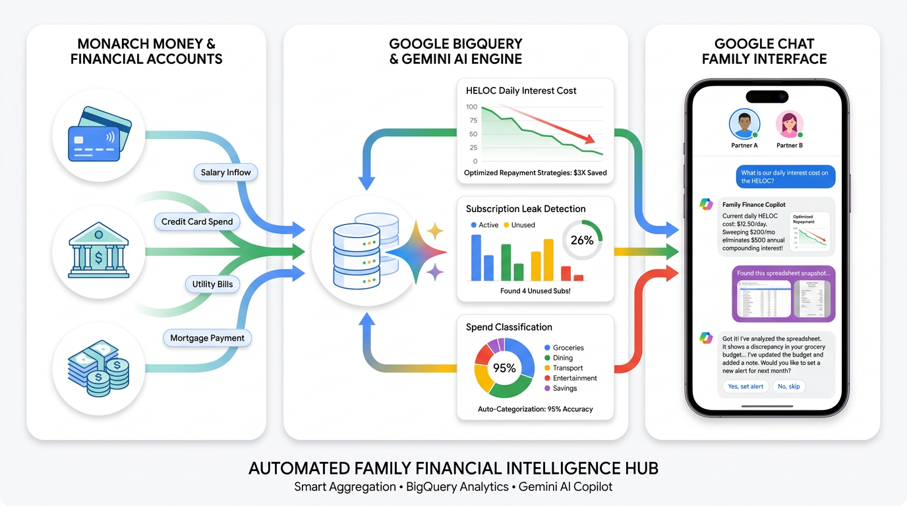
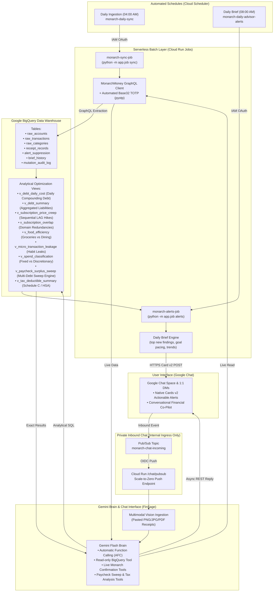

# FinSage: Family Financial Intelligence Hub
**Automated Personal Finance, Cash Flow & Debt Acceleration Hub via Monarch Money, Google BigQuery & Gemini Flash**

[](https://www.python.org/)
[](https://fastapi.tiangolo.com/)
[](https://cloud.google.com/)
[](https://cloud.google.com/bigquery)
[](https://deepmind.google/technologies/gemini/)
[](https://www.terraform.io/)
[](tests/)
[](LICENSE)

<p align="center">
  
</p>

An enterprise-grade, serverless family financial advisor, cash flow coordinator, and debt acceleration engine deployed to **Google Cloud Platform**. It bridges **Monarch Money** directly into **Google BigQuery** data warehouse models, powered by an autonomous, bidirectional **Google Chat Co-Pilot (FinSage)** running **Gemini Flash** with **Automatic Function Calling (AFC)**, **Multimodal Vision**, and **Long-Term Memory**.

---

## 📚 Documentation Index

FinSage documentation is broken out into dedicated guides:

| Guide | Description |
| :--- | :--- |
| **[BigQuery Analytical Views](docs/analytical-views.md)** | Deep dive into the 18+ BigQuery models: daily debt carry math, subscription price creep, grocery-to-dining ratios, and paycheck sweep algorithms. |
| **[Google Chat Financial Advisor](docs/chat-advisor.md)** | FinSage bot architecture, slash command reference (`/brief`, `/sweep`, `/tax`, `/digest`), multimodal receipt ingestion, and guarded mutations. |
| **[Configuration & Custom Rates](docs/configuration.md)** | Setting baseline APRs (Mortgage, HELOC, Loans), account overrides, decommissioned accounts, and Secret Manager resolution. |
| **[Deployment & Operations](docs/deployment.md)** | Step-by-step setup with Terraform, Google Cloud Build, Cloud Run Jobs, Cloud Scheduler, and private Pub/Sub push configuration. |

---

## Core Engineering Highlights

* **Deterministic Arithmetic over Hallucination**: AI models are prone to arithmetic errors. All financial calculations—daily compounding debt carry across mortgages and HELOCs, subscription price creep, dining efficiency ratios, and paycheck surplus sweeps—are executed deterministically in BigQuery SQL views. Gemini queries these views via read-only tools to ground recommendations in exact arithmetic.
* **Paycheck Surplus Sweep & Debt Acceleration**: Automatically models 30-day fixed overhead burn baselines plus upcoming lump-sum bills. When payroll deposits land, FinSage calculates safe checking reserves and computes the exact sweep amount to pay down high-carry debt, reporting daily, monthly, and annual compound interest saved.
* **Multimodal Vision & Tax Ingestion**: Paste receipts or invoices directly into Google Chat. Gemini Vision extracts itemized lines, scrubs sensitive PII (SSN, EIN, card numbers), categorizes tax deductibility (Schedule C, HSA/FSA, Charities), and asymmetrically matches against posted bank debits with tip authorization handling.
* **Researched Category Clean-up**: `/categorize` researches uncategorized and inconsistently categorized merchants on the web, starts from your live Monarch categories and rules, proposes fixes for up to 10 merchants on one card, ranked by dollars at stake, and applies the ticked ones in Monarch Money: past transactions are recategorized and a Monarch rule is added so future ones are categorized automatically. Rejected suggestions are not proposed again.
* **Business Trips & Tags**: `/trip Springfield Mar 10-14, flew Example Air` finds the trip's airfare, hotel and ground transport and tags the ticked charges `Business` plus a trip tag in Monarch, without changing categories or adding rules. Business-tagged spending is left out of household totals, trends, pacing and alerts. See [docs/business-trips.md](docs/business-trips.md).
* **Guarded Mutations & Cryptographic Confirmation**: When modifying transaction categories or updating records, FinSage requires physical confirmation via interactive Google Chat Cards v2 with HMAC-SHA256 tokens and an append-only BigQuery audit trail.
* **Private-Ingress Perimeter Security**: Cloud Run runs with `--ingress internal` and `--no-allow-unauthenticated`. Chat events reach it only through a **Google Cloud Pub/Sub push subscription** (`monarch-chat-push` → `/chat/pubsub`) authenticated with an OIDC token, so the service has no public endpoint.
* **Scale-to-Zero Efficiency**: The Cloud Run service runs with `--min-instances 0` and request-based CPU, so it costs nothing while idle. Batch work runs as short Cloud Run Jobs. See the [cost profile](docs/deployment.md#7-operating-cost-profile).

---

## Architectural Workflow (Private-Ingress Posture)


```mermaid
flowchart TD
    subgraph Scheduling ["Automated Schedules (Cloud Scheduler)"]
        CronSync["Daily Ingestion (04:00 AM)<br/>monarch-daily-sync"]
        CronAlert["Daily Brief (08:00 AM)<br/>monarch-daily-advisor-alerts"]
    end

    subgraph BatchLayer ["Serverless Batch Layer (Cloud Run Jobs)"]
        JobSync["monarch-sync-job<br/>(python -m app.job sync)"]
        JobAlert["monarch-alerts-job<br/>(python -m app.job alerts)"]
        MMClient["MonarchMoney GraphQL Client<br/>+ Automated Base32 TOTP (pyotp)"]
        AdvisorEngine["Daily Brief Engine<br/>(top new findings, goal pacing, trends)"]
    end

    subgraph DataWarehouse ["Google BigQuery Data Warehouse"]
        RawTables["Tables:<br/>• raw_accounts<br/>• raw_transactions<br/>• raw_categories<br/>• receipt_records<br/>• alert_suppression<br/>• brief_history<br/>• mutation_audit_log"]
        Views["Analytical Optimization Views:<br/>• v_debt_daily_cost (Daily Compounding Debt)<br/>• v_debt_summary (Aggregated Liabilities)<br/>• v_subscription_price_creep (Sequential LAG Hikes)<br/>• v_subscription_overlap (Domain Redundancies)<br/>• v_food_efficiency (Groceries vs Dining)<br/>• v_micro_transaction_leakage (Habit Leaks)<br/>• v_spend_classification (Fixed vs Discretionary)<br/>• v_paycheck_surplus_sweep (Multi-Debt Sweep Engine)<br/>• v_tax_deductible_summary (Schedule C / HSA)"]
    end

    subgraph PrivateIngestion ["Private Inbound Chat (Internal Ingress Only)"]
        Topic["Pub/Sub Topic<br/>monarch-chat-incoming"]
        Worker["Cloud Run /chat/pubsub<br/>Scale-to-Zero Push Endpoint"]
    end

    subgraph Intelligence ["Gemini Brain & Chat Interface (FinSage)"]
        GeminiFlash["Gemini Flash Brain<br/>• Automatic Function Calling (AFC)<br/>• Read-only BigQuery Tool<br/>• Live Monarch Confirmation Tools<br/>• Paycheck Sweep & Tax Analysis Tools"]
        MultimodalVision["Multimodal Vision Ingestion<br/>(Pasted PNG/JPG/PDF Receipts)"]
    end

    subgraph ChatSpace ["User Interface (Google Chat)"]
        GoogleChat["Google Chat Space & 1:1 DMs<br/>• Native Cards v2 Actionable Alerts<br/>• Conversational Financial Co-Pilot"]
    end

    CronSync -->|"IAM OAuth"| JobSync
    JobSync --> MMClient
    MMClient -->|"GraphQL Extraction"| RawTables
    RawTables --> Views

    CronAlert -->|"IAM OAuth"| JobAlert
    Views --> JobAlert
    JobAlert --> AdvisorEngine
    AdvisorEngine -->|"HTTPS Card v2 POST"| GoogleChat

    GoogleChat -->|"Inbound Event"| Topic
    Topic -->|"OIDC Push"| Worker
    Worker --> MultimodalVision
    MultimodalVision --> GeminiFlash
    GeminiFlash -->|"Analytical SQL"| Views
    Views -->|"Exact Results"| GeminiFlash
    GeminiFlash -->|"Live Read"| MMClient
    MMClient -->|"Live Data"| GeminiFlash
    GeminiFlash -->|"Async REST Reply"| GoogleChat
```

---

## Google Chat Commands Cheatsheet

| Command | Action | Primary Model / Tool |
| :--- | :--- | :--- |
| **`/brief`** | Shows today's summarized brief: recent activity, goal pacing, the most notable new findings, and 13-week trends. | `app/daily_brief.py`, `brief_history` |
| **`/alerts`** | Runs every spend alert check and replies with the full list. | `v_duplicate_charges`, `v_subscription_price_creep`, and others |
| **`/sweep`** | Computes safe paycheck surplus to sweep to high-rate variable debt. | `v_paycheck_surplus_allocation` |
| **`/tax [YYYY]`** | Displays annual tax deductibility summary (Schedule C, HSA, Charities). | `v_tax_deductible_summary` |
| **`/digest [weekly\|monthly]`** | Generates an executive CFO performance briefing. | `v_debt_summary`, `v_spend_classification` |
| **`/sync`** | Triggers immediate Monarch Money ingestion into BigQuery. | `monarch_service.sync_accounts_to_bq()` |
| **`/receipt`** *(with attachment)* | Extracts and logs receipt with IRS tax classification and bank match. | Gemini Vision, `raw_transactions` |
| **`/help`** | Displays quick command reference and usage examples. | Built-in |

---

## Quickstart (2-Minute Local Setup)

```bash
# 1. Clone repository and install dependencies
git clone https://github.com/n0012/family-financial-intelligence-hub.git
cd family-financial-intelligence-hub
uv venv && uv pip install -r requirements.txt -r requirements-dev.txt

# 2. Enable the private-data hooks (this is a public repo; see AGENTS.md)
git config core.hooksPath .githooks

# 3. Configure credentials & custom interest rates
cp .env.example .env.local
cp config.example.yaml config.yaml

# 4. Run automated test suite
uv run python -m pytest -v
```

For complete deployment instructions, see the **[Deployment & Operations Guide](docs/deployment.md)**.

---

## Contributing & Privacy

This repository is public and models a household's finances, so no personal or confidential data may be committed: no names, emails, project IDs, account numbers, balances, merchants or real figures, in code, tests, docs, commit messages or pull requests. [`AGENTS.md`](AGENTS.md) holds the full rules for human and AI contributors.

`scripts/check_private_data.py` enforces them in the pre-commit, commit-msg and pre-push hooks and in the `private-data` GitHub workflow, which also scans PR titles and descriptions. Run it by hand with `python3 scripts/check_private_data.py --all`.

---

## License & Acknowledgments

This project is licensed under the [MIT License](LICENSE).

Inspirations & libraries:
* [Concept and Architecture Reference](https://chatgpt.com/share/69f7d4a5-a8e4-83ea-b6e2-78fb8eb79339)
* [`hammem/monarchmoney`](https://github.com/hammem/monarchmoney) — Python client library for Monarch Money.
* [`6missedcalls/personal-finance-skill`](https://github.com/6missedcalls/personal-finance-skill) — Multi-tier policy guardrails, FRED macro-economic grounding, and IRS tax classification schemas.
