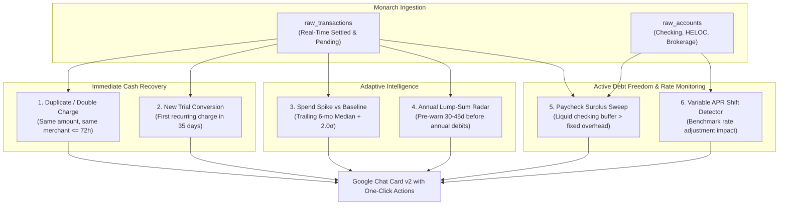

# FinSage: Strategic Anomaly Alerting & Debt Paydown Engine
*Co-developed by Antigravity & Claude Code for FinSage (Family Financial Intelligence Hub)*

---

## Executive Overview

FinSage's alert engine is grounded in **deterministic BigQuery SQL views** combined with **Vertex AI Memory Bank preferences** and **Gemini 3.8 Flash Automatic Function Calling**. 

Rather than sending vanity notifications, every alert in FinSage adheres to three criteria:
1. **Mathematical Grounding**: Computed deterministically in BigQuery SQL with zero LLM hallucination.
2. **Actionability**: Paired with an immediate, frictionless decision (e.g., interactive Google Chat Card v2 button, merchant refund request, or debt sweep).
3. **Debt Paydown Linkage**: Expressed in terms of **daily interest eliminated** or **months shaved** off the family's active debt or credit lines (e.g., daily carrying cost reductions, compounding interest eliminated per sweep, and accelerating milestone target payoff dates).

---

## Current Production Baseline (PR 6 Complete)

| Alert Key | Type | Trigger / Logic | BigQuery Source |
| :--- | :--- | :--- | :--- |
| `price_creep:{merchant}` | `PRICE_CREEP` | Latest bill exceeds the mean of the prior 3 cycles by 3–40% and >$0.50, within 45 days, on a `CANCELLABLE` or `RESHOPPABLE` merchant | `v_subscription_price_creep` |
| `overlap:{domain}` | `SUBSCRIPTION_OVERLAP` | Concurrently active, functionally substitutable services in one domain (3+ for video streaming, 2+ elsewhere) with combined run rate ≥ $15/mo | `v_subscription_overlap` |
| `utility_season:{merchant}:{yyyy-mm}` | `UTILITY_SEASONAL_SPIKE` | Metered utility month ≥ 25% above the same calendar month in prior years (and >2σ where enough history exists) | `v_utility_seasonal_baseline` |
| `micro:{merchant}` | `MICRO_TRANSACTION_LEAKAGE` | $\ge$ 4 sub-$35 convenience charges in 90 days with annualized run-rate | `v_micro_transaction_leakage` |
| `food_leakage:{yyyy-mm}` | `FOOD_LEAKAGE` | Dining & delivery spend exceeds 40% of total food budget | `v_food_efficiency` |
| `budget_cap:{cat}:{yyyy-mm}` | `BUDGET_CAP_EXCEEDED` | Spend exceeds user limit stored in Vertex AI Memory Bank | `raw_transactions` + Memory Bank |
| `budget_pacing:{cat}:{yyyy-mm}` | `BUDGET_CAP_PACING` | Spend pacing exceeds 85% of monthly budget target | `raw_transactions` + Memory Bank |
| `heloc_daily_cost` | `HELOC_OPPORTUNITY` | Computes daily compounding carrying cost & opportunity savings from principal sweeps | `v_heloc_daily_cost` |

---

## Next-Generation Anomaly Alerts & Debt Triggers (PR 7+ Roadmap)

The following 6 high-impact alerts were strategized in collaboration with **Claude Code** to maximize cash recovery, eliminate trial creep, and accelerate debt payoff:



---

### 1. Duplicate / Double Charge Detection (`DUPLICATE_CHARGE`)
* **Financial Rationale**: Direct cash recovery rather than behavior change. Merchant double-taps, POS glitch resubmissions, and accidental double online orders occur frequently. Unlike behavior shifts, catching this converts directly into an immediate bank or merchant refund.
* **BigQuery SQL Structure (`v_duplicate_charges`)**:
  ```sql
  CREATE OR REPLACE VIEW `family_finance.v_duplicate_charges` AS
  SELECT
      t1.transaction_id AS primary_id,
      t2.transaction_id AS duplicate_id,
      COALESCE(t1.clean_merchant_name, t1.merchant_name) AS merchant,
      t1.amount,
      t1.transaction_date AS original_date,
      t2.transaction_date AS duplicate_date,
      DATE_DIFF(t2.transaction_date, t1.transaction_date, DAY) AS days_between
  FROM `family_finance.raw_transactions` t1
  JOIN `family_finance.raw_transactions` t2
    ON COALESCE(t1.clean_merchant_name, t1.merchant_name) = COALESCE(t2.clean_merchant_name, t2.merchant_name)
   AND t1.amount = t2.amount
   AND t1.transaction_id < t2.transaction_id
   AND t1.amount < 0
   AND t1.pending = FALSE AND t2.pending = FALSE
   AND t2.transaction_date BETWEEN t1.transaction_date AND DATE_ADD(t1.transaction_date, INTERVAL 3 DAY)
   AND LOWER(t1.category_name) NOT IN ('gas', 'public transit', 'parking', 'groceries')
  WHERE t1.transaction_date >= DATE_SUB(CURRENT_DATE(), INTERVAL 14 DAY);
  ```
* **Alert Trigger & Action**: Fires when `days_between <= 3`. Google Chat card displays: *"Potential Double Charge: $84.50 at Home Depot on Sep 8 & Sep 9. Request refund from merchant."*
* **Debt Paydown Linkage**: Every $100 refunded and swept to debt permanently eliminates recurring daily interest.

---

### 2. New Recurring Charge / Free Trial Conversion (`NEW_SUBSCRIPTION_DETECTED`)
* **Financial Rationale**: Free trials that convert to paid subscriptions ($14.99/mo, $29.99/mo) are the most common source of lifestyle creep. Existing subscription views only flag price increases on established recurring items; brand-new recurring services are invisible during the initial 30-day cancellation window.
* **BigQuery SQL Structure (`v_new_subscriptions`)**:
  ```sql
  CREATE OR REPLACE VIEW `family_finance.v_new_subscriptions` AS
  WITH merchant_history AS (
      SELECT
          COALESCE(clean_merchant_name, merchant_name) AS merchant,
          category_name,
          MIN(transaction_date) AS first_charge_date,
          MAX(transaction_date) AS latest_charge_date,
          COUNT(*) AS charge_count,
          ROUND(AVG(ABS(amount)), 2) AS avg_charge
      FROM `family_finance.raw_transactions`
      WHERE amount < 0
        AND pending = FALSE
        AND (is_recurring = TRUE OR LOWER(category_name) IN ('subscriptions', 'phone', 'internet & cable', 'fitness'))
      GROUP BY 1, 2
  )
  SELECT
      merchant,
      category_name,
      first_charge_date,
      avg_charge,
      ROUND(avg_charge * 12, 2) AS annualized_cost
  FROM merchant_history
  WHERE first_charge_date >= DATE_SUB(CURRENT_DATE(), INTERVAL 35 DAY)
    AND charge_count <= 2;
  ```
* **Alert Trigger & Action**: Fires when a merchant's first charge is detected within the last 35 days. Card v2 offers: *"Cancel / Keep"* with direct link to cancelation portal.
* **Debt Paydown Linkage**: Canceling an unneeded $25/mo trial frees **$300/year** for debt acceleration and compound interest savings.

---

### 3. Adaptive Category Outlier Spikes vs 6-Month Baseline (`CATEGORY_SPEND_SPIKE`)
* **Financial Rationale**: Hardcoded budget rules (e.g. $450 dining) miss irregular categories (veterinary, home maintenance, auto repairs, clothing). Statistical baseline comparison detects unexpected surges before month-end.
* **BigQuery SQL Structure (`v_category_spend_baseline`)**:
  ```sql
  CREATE OR REPLACE VIEW `family_finance.v_category_spend_baseline` AS
  WITH monthly_category AS (
      SELECT
          category_name,
          FORMAT_DATE('%Y-%m', transaction_date) AS spend_month,
          ROUND(SUM(ABS(amount)), 2) AS monthly_total
      FROM `family_finance.raw_transactions`
      WHERE amount < 0
        AND pending = FALSE
        AND transaction_date >= DATE_SUB(CURRENT_DATE(), INTERVAL 7 MONTH)
        AND FORMAT_DATE('%Y-%m', transaction_date) < FORMAT_DATE('%Y-%m', CURRENT_DATE())
      GROUP BY 1, 2
  ),
  baseline_stats AS (
      SELECT
          category_name,
          ROUND(AVG(monthly_total), 2) AS mean_monthly_spend,
          ROUND(STDDEV(monthly_total), 2) AS stddev_monthly_spend,
          COUNT(*) AS recorded_months
      FROM monthly_category
      GROUP BY 1
      HAVING recorded_months >= 3
  ),
  current_month AS (
      SELECT
          category_name,
          ROUND(SUM(ABS(amount)), 2) AS current_mtd_spend
      FROM `family_finance.raw_transactions`
      WHERE amount < 0
        AND pending = FALSE
        AND FORMAT_DATE('%Y-%m', transaction_date) = FORMAT_DATE('%Y-%m', CURRENT_DATE())
      GROUP BY 1
  )
  SELECT
      c.category_name,
      c.current_mtd_spend,
      b.mean_monthly_spend,
      b.stddev_monthly_spend,
      ROUND((c.current_mtd_spend - b.mean_monthly_spend) / NULLIF(b.stddev_monthly_spend, 0), 2) AS z_score
  FROM current_month c
  JOIN baseline_stats b ON c.category_name = b.category_name
  WHERE c.current_mtd_spend > b.mean_monthly_spend + (2.0 * COALESCE(b.stddev_monthly_spend, 50.0))
    AND c.current_mtd_spend >= 150.00;
  ```
* **Alert Trigger & Action**: Fires when current spend exceeds baseline mean by > 2.0 standard deviations.
* **Debt Paydown Linkage**: Catches unexpected leaks early, allowing the family to throttle discretionary spend before planned debt sweeps are compromised.

---

### 4. Paycheck Surplus & Cash Sweep Trigger (`PAYCHECK_SURPLUS_SWEEP`)
* **Financial Rationale**: Liquid checking accounts earning minimal APY while carrying variable debt cost money every day. The moment a paycheck or bonus lands, cash above a safe operating buffer should be swept into debt reduction immediately.
* **BigQuery SQL Structure (`v_paycheck_surplus_sweep`)**:
  ```sql
  CREATE OR REPLACE VIEW `family_finance.v_paycheck_surplus_sweep` AS
  WITH latest_inflow AS (
      SELECT
          transaction_id,
          account_id,
          merchant_name,
          ABS(amount) AS inflow_amount,
          transaction_date
      FROM `family_finance.raw_transactions`
      WHERE amount > 2500.00
        AND pending = FALSE
        AND transaction_date >= DATE_SUB(CURRENT_DATE(), INTERVAL 3 DAY)
        AND (LOWER(category_name) LIKE '%paycheck%' OR LOWER(category_name) LIKE '%income%')
  ),
  liquid_balance AS (
      SELECT
          SUM(current_balance) AS total_checking_balance
      FROM `family_finance.raw_accounts`
      WHERE LOWER(type_name) IN ('depository', 'checking')
        AND is_asset = TRUE
  ),
  monthly_fixed_overhead AS (
      SELECT
          COALESCE(SUM(monthly_run_rate), 4500.00) AS fixed_monthly_burn
      FROM `family_finance.v_active_subscriptions`
  )
  SELECT
      i.merchant_name AS employer,
      i.inflow_amount,
      i.transaction_date,
      l.total_checking_balance,
      f.fixed_monthly_burn,
      -- Recommended buffer: 1.25x monthly fixed expenses
      ROUND(f.fixed_monthly_burn * 1.25, 2) AS target_cash_reserve,
      GREATEST(0.0, ROUND(l.total_checking_balance - (f.fixed_monthly_burn * 1.25), 2)) AS recommended_debt_sweep
  FROM latest_inflow i
  CROSS JOIN liquid_balance l
  CROSS JOIN monthly_fixed_overhead f;
  ```
* **Alert Trigger & Action**: Fires when paycheck posts and `recommended_debt_sweep >= $500`. Suggests: *"Paycheck received ($X). Your checking balance ($Y) exceeds the recommended 1.25x monthly buffer. Sweep $Z to debt today to eliminate daily interest carry."*
* **Debt Paydown Linkage**: Directing surplus liquid cash directly into principal reduction immediately reduces daily carrying costs.

---

### 5. Annual & Semi-Annual Sinking Fund Radar (`ANNUAL_BILL_RADAR`)
* **Financial Rationale**: Large annual or semi-annual charges (car insurance, property taxes, HOA dues, annual club memberships) frequently shock monthly cash flow, forcing unplanned draws on lines of credit. Predicting them 30 days ahead allows pre-funding from cash flow.
* **BigQuery SQL Structure (`v_annual_bill_radar`)**:
  ```sql
  CREATE OR REPLACE VIEW `family_finance.v_annual_bill_radar` AS
  SELECT
      merchant,
      category_name,
      avg_charge AS anticipated_amount,
      billing_cadence,
      DATE_ADD(last_seen, INTERVAL CAST(avg_cadence_days AS INT64) DAY) AS anticipated_due_date,
      DATE_DIFF(DATE_ADD(last_seen, INTERVAL CAST(avg_cadence_days AS INT64) DAY), CURRENT_DATE(), DAY) AS days_until_due
  FROM `family_finance.v_active_subscriptions`
  WHERE billing_cadence IN ('ANNUAL', 'QUARTERLY')
    AND avg_charge >= 100.00
    AND DATE_DIFF(DATE_ADD(last_seen, INTERVAL CAST(avg_cadence_days AS INT64) DAY), CURRENT_DATE(), DAY) BETWEEN 1 AND 30;
  ```
* **Alert Trigger & Action**: Fires 30 days and 7 days prior to anticipated renewal. Google Chat card highlights: *"Upcoming Annual Charge: Annual Home Insurance ($1,200) estimated in 18 days. Pre-fund from checking to avoid drawing on credit lines."*
* **Debt Paydown Linkage**: Preventing an unplanned draw avoids adding recurring interest carry to the family balance sheet.

---

### 6. Variable Interest Rate Shift Detector (`INTEREST_RATE_SHIFT`)
* **Financial Rationale**: Credit line interest rates are variable and tied to Prime. When benchmark or lender rates shift by 25 to 50 bps, daily carry shifts without an explicit notification from the bank.
* **BigQuery SQL Structure (`v_heloc_rate_history`)**:
  ```sql
  CREATE OR REPLACE VIEW `family_finance.v_heloc_rate_history` AS
  SELECT
      display_name,
      current_balance,
      apr,
      daily_interest_cost,
      monthly_interest_cost,
      ROUND(current_balance * 0.0025 / 365, 2) AS cost_per_quarter_point_hike_daily,
      ROUND(current_balance * 0.0025 / 12, 2) AS cost_per_quarter_point_hike_monthly
  FROM `family_finance.v_heloc_daily_cost`;
  ```
* **Alert Trigger & Action**: Detects effective interest rate adjustments. Calculates exact monthly dollar impact and updates the required monthly principal paydown needed to meet target debt-free milestones.

---

## Smart Suppression & Card v2 Snooze Integration

All proposed alert views integrate seamlessly with our existing **`family_finance.alert_suppression`** table:
- Every new alert defines a deterministic `alert_key`:
  - `dupe:{primary_id}:{duplicate_id}`
  - `new_sub:{clean_merchant}`
  - `spike:{category}:{yyyy-mm}`
  - `sweep:{account_id}:{yyyy-mm-dd}`
  - `annual_radar:{clean_merchant}:{yyyy}`
- All cards render with the **"💤 Snooze"** widget, allowing 7, 14, or 30-day suppressions directly from Google Chat or via conversational command (`snooze_spend_alert`).
