# BigQuery Analytical Views & Data Model

FinSage decouples transaction ingestion from financial intelligence using **Google BigQuery** GoogleSQL views. All mathematical computations—such as daily liability interest carry, subscription price creep, utility seasonality, and paycheck sweeps—are performed deterministically in SQL to eliminate AI arithmetic hallucinations.

---

## Architecture Overview

```mermaid
flowchart TD
    subgraph Storage ["Raw Ingested Storage"]
        RA["raw_accounts"]
        RT["raw_transactions"]
        RC["raw_categories"]
    end

    subgraph CoreViews ["Lifecycle & Account Intelligence"]
        AL["v_account_lifecycle"]
        MD["v_merchant_domain"]
    end

    subgraph DebtViews ["Multi-Facility Debt Intelligence"]
        DDC["v_debt_daily_cost"]
        DS["v_debt_summary"]
        HDC["v_heloc_daily_cost"]
    end

    subgraph Subscriptions ["Subscription & Contract Analysis"]
        SC["v_subscription_charges"]
        AS["v_active_subscriptions"]
        PC["v_subscription_price_creep"]
        SO["v_subscription_overlap"]
        NS["v_new_subscriptions"]
    end

    subgraph SpendingBehavior ["Cash Flow & Behavior Outliers"]
        SB["v_spend_classification"]
        FE["v_food_efficiency"]
        ML["v_micro_transaction_leakage"]
        UB["v_utility_seasonal_baseline"]
        DC["v_duplicate_charges"]
        CSB["v_category_spend_baseline"]
        ABR["v_annual_bill_radar"]
    end

    subgraph Optimization ["Capital Allocation & Tax"]
        PSS["v_paycheck_surplus_allocation<br/>(v_paycheck_surplus_sweep)"]
        TDS["v_tax_deductible_summary"]
    end

    RA --> AL
    AL --> DDC
    DDC --> DS
    DDC --> HDC
    RT --> SC
    SC --> AS
    AS --> PC
    AS --> SO
    RT --> FE
    RT --> ML
    RT --> UB
    RT --> DC
    RT --> CSB
    RT --> ABR
    RA --> PSS
    SB --> PSS
    ABR --> PSS
    DDC --> PSS
    RT --> TDS
```



---

## 1. Storage & Audit Tables

| Table Name | Description & Storage Role |
| :--- | :--- |
| **`raw_accounts`** | Active account balances, credit limits, reported APRs, account types, and institution metadata synced from Monarch Money. |
| **`raw_transactions`** | Deduplicated, sanitized transaction stream with timestamps, clean merchant names, amounts, category IDs, and pending flags. |
| **`raw_categories`** | Budget envelopes categorized into Fixed Overhead, Discretionary, Debt Payoff, and Income. |
| **`receipt_records`** | Append-only store for multimodal receipts with itemized lines, Zero-PII scrubbing, and IRS tax classification. |
| **`alert_suppression`** | Active suppression table managing 7–30 day snoozes and alert deduplication keys. |
| **`mutation_audit_log`** | Immutable audit trail tracking user email, mutation IDs, cryptographic validity, and target parameters. |

---

## 2. Account Lifecycle & Multi-Facility Debt Views

### `v_account_lifecycle`
Dynamically classifies accounts as `PRIMARY` vs `SUPERSEDED` based on activity recency, non-zero balance, and transaction count. Resolves duplicate accounts caused by bank platform migrations and mergers. Also delineates `account_class` across `MORTGAGE`, `HOME_EQUITY_LINE`, `CREDIT_CARD`, and `OTHER_LOAN` passing through verified APRs from Monarch and configuration overrides, flagging `is_apr_estimated` when estimated.

### `v_debt_daily_cost`
Computes the exact daily interest cost and monthly carrying cost across all active liability facilities (Mortgage, HELOC, Loans, Revolving Credit):

```math
\text{daily\_interest\_cost} = \frac{\text{current\_balance} \times \text{apr}}{365}
```
```math
\text{monthly\_interest\_cost} = \frac{\text{current\_balance} \times \text{apr}}{12}
```

### `v_debt_summary`
Aggregates portfolio-wide liability metrics into a single summary row:
* **`total_debt_balance`**: Sum of all primary liability balances.
* **`total_daily_interest_cost`**: Total portfolio daily interest drag ($/day).
* **`total_monthly_interest_cost`**: Total portfolio monthly interest carry ($/month).
* **`mortgage_balance` & `mortgage_daily_interest_cost`**: Amortized mortgage breakout.
* **`heloc_balance` & `heloc_daily_interest_cost`**: Variable revolving line breakout.
* **`other_debt_balance` & `other_debt_daily_interest_cost`**: Auto, personal, and credit card debt breakout.

### `v_heloc_daily_cost`
A focused backwards-compatible view querying active lines of credit where `debt_type = 'HELOC'`.

---

## 3. Subscription & Recurring Expense Views

### `v_merchant_domain`
Maps each merchant to its functional industry domain and assigns an advice disposition:
* **`CANCELLABLE`**: Discretionary consumer subscriptions (streaming, music, gaming). Advice: cancel or rotate.
* **`RESHOPPABLE`**: Contracted services (auto/home insurance, broadband, mobile carrier, home security). Advice: requote or renegotiate renewal rates, never cancel.
* **`ESSENTIAL_METERED`**: Regulated utility monopolies (electric, gas, municipal water). Advice: audit seasonal consumption against baseline.
* **`NOT_A_SUBSCRIPTION`**: Retailers or merchants that should never be treated as recurring plans.

### `v_subscription_charges`
The cleaned recurring-charge ledger. Respects the aggregator's recurrence flag where available, and filters out incidental point-of-sale transactions by requiring charges to fall within 60%–200% of the merchant's historical median.

### `v_active_subscriptions`
Consolidates to one row per merchant (preventing fragmentation if categories change). Identifies billing cadence (`MONTHLY`, `ANNUAL`, `QUARTERLY`) and derives cadence-normalized `monthly_run_rate` and `estimated_annual_cost`.

### `v_subscription_price_creep`
Detects unauthorized or silent subscription price hikes:
* Compares latest charge against the 3-cycle trailing average via `LAG()`.
* Filters for increases between +3% and +40% occurring within the last 45 days.
* Computes `annual_impact` (the annualized increase), ensuring advice focuses on the recoverable increment rather than the whole plan.

### `v_subscription_overlap`
Identifies concurrent, functionally redundant subscriptions within the same domain (e.g. 3+ simultaneous video streaming services). Computes `consolidation_savings_monthly` as the total category spend minus the single largest plan.

### `v_new_subscriptions`
Flags newly detected recurring subscriptions within their first 35 days to catch unwanted free-trial rollovers before long-term commitments lock in.

---

## 4. Cash Flow, Pacing & Habit Views

### `v_utility_seasonal_baseline`
Compares metered utility charges against the **same calendar month in prior years**, eliminating false alarms caused by expected winter heating or summer cooling spikes.

### `v_food_efficiency`
Calculates the monthly ratio between grocery store purchases and dining out / food delivery markups (DoorDash, UberEats, Grubhub). Highlights when dining exceeds 30% of total nutritional spend.

### `v_micro_transaction_leakage`
Detects high-frequency convenience transactions under $35 (coffee shops, convenience stores, app purchases) and projects their annualized burn rate.

### `v_spend_classification`
Categorizes monthly outflows into **Fixed Overhead** vs. **Discretionary Spend**, establishing the baseline burn rate required for safety buffer calculations.

### `v_duplicate_charges`
Identifies identical charges from the same merchant within a 3-day sliding window to flag billing errors and vendor double-charges.

### `v_category_spend_baseline`
Computes 6-month statistical rolling mean and standard deviation per spending category to detect spend spikes exceeding $+2\sigma$.

### `v_annual_bill_radar`
Scans for periodic quarterly/annual lump-sum obligations (property taxes, insurance premiums, vehicle registrations) due within the next 30 days to protect liquid cash reserves.

---

## 5. Capital Allocation & Tax Intelligence

### `v_paycheck_surplus_allocation` (`v_paycheck_surplus_sweep`)
Evaluates recent paycheck deposits against liquid checking reserves, 30-day fixed overhead burn (with a 15% safety buffer), and upcoming 30-day lump-sum bills:

```math
\text{safe\_reserve\_buffer} = \max(2000, (\text{monthly\_fixed\_burn} \times 1.15) + \text{upcoming\_30d\_lump\_sums})
```
```math
\text{safe\_surplus} = \max(0, \text{liquid\_balance} - \text{safe\_reserve\_buffer})
```
```math
\text{recommended\_sweep} = \min(\text{safe\_surplus}, \text{target\_debt\_balance})
```

Surplus cash is routed to the highest-rate liability (e.g. variable HELOC), calculating immediate daily, monthly, and annual interest carry savings while reporting total multi-facility debt posture.

### `v_tax_deductible_summary`
Aggregates verified multimodal receipts and deductible expenses by tax year across IRS classifications: Schedule C (Business Expense), IRC §213(d) (HSA/FSA Medical), IRC §170 (Charitable Donations), and Childcare Tax Credits.
