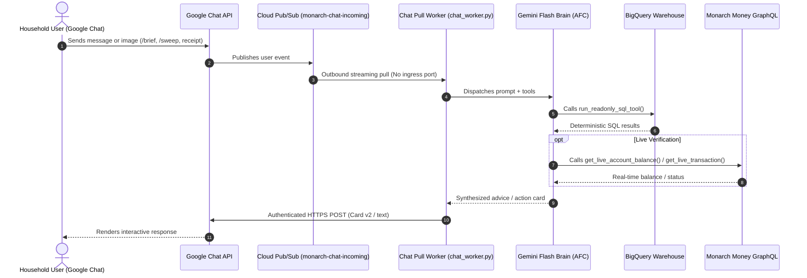

# Google Chat Financial Advisor (FinSage)

**FinSage** operates as an interactive Google Chat Bot supporting 1:1 direct messages and collaborative family chat spaces. Powered by **Gemini Flash**, it combines deterministic BigQuery analytical queries, real-time Monarch API lookups, multimodal computer vision, and Vertex AI long-term memory.

---

## 1. Zero-Ingress Chat Architecture

FinSage connects to Google Chat with a **zero-ingress security posture**:

FinSage opens connections outward via an asynchronous **Pub/Sub streaming pull** (`python -m app.chat_worker`). The container exposes zero listening HTTP ports to the public internet, eliminating inbound attack surfaces.

---

## 2. Slash Commands Cheatsheet

| Command | Action Description | Primary Tools / Views Used |
| :--- | :--- | :--- |
| **`/brief`** or **`/alerts`** | Renders today's executive Morning Financial Synopsis and active spend alerts. | `v_debt_summary`, `v_spend_classification`, `v_subscription_price_creep` |
| **`/sweep`** | Evaluates checking liquidity to calculate safe surplus sweeps to high-rate debt. | `v_paycheck_surplus_allocation`, `v_annual_bill_radar` |
| **`/tax [YYYY]`** | Displays annual tax deductibility summary (Schedule C, HSA, Charities). | `v_tax_deductible_summary` |
| **`/digest [weekly\|monthly]`** | Generates an executive CFO performance briefing. | `v_debt_summary`, `v_spend_classification` |
| **`/sync`** | Triggers immediate Monarch Money ingestion into BigQuery. | `monarch_service.sync_accounts_to_bq()` |
| **`/receipt`** *(with image)* | Extracts line items, scrubs PII, classifies tax deductibility, and matches bank ledger. | Gemini Vision, `raw_transactions` |
| **`/help`** | Displays quick command reference and suggested natural language prompts. | Built-in |

---

## 3. Conversational Reasoning & Natural Language

Gemini automatically maps user intent to BigQuery analytical views using Automatic Function Calling (AFC):

* *"What is our daily debt interest cost across mortgage and HELOC right now?"*  
  $\rightarrow$ Queries `v_debt_summary` and reports total balance ($884k), daily carry ($113.74/day), and mortgage vs HELOC breakdowns.
* *"Which subscriptions increased in price over the last year?"*  
  $\rightarrow$ Queries `v_subscription_price_creep` and advises on the exact annualized increase.
* *"How much did we spend on dining out vs groceries last month?"*  
  $\rightarrow$ Queries `v_food_efficiency` to compare grocery baseline vs dining markups.
* *"Where are our top micro-transaction leaks under $35?"*  
  $\rightarrow$ Queries `v_micro_transaction_leakage` for coffee shops and convenience spending.
* *"How much safe surplus can we sweep from checking to pay down debt today?"*  
  $\rightarrow$ Queries `v_paycheck_surplus_allocation` to determine safe paydown allocation.

---

## 4. Daily Morning Financial Synopsis (`/brief`, `/alerts`)

Every morning at 08:00 AM (or on-demand via `/brief`), FinSage posts a two-tier **Google Chat Card v2**:

1. **🌅 Morning Financial Synopsis**:
   * **Pacing Thermometer**: Visual ASCII bar showing month elapsed vs MTD spend velocity:  
     `████░░░░░░ Day 12/30 (40% elapsed) • MTD Outflow: $1,440.00 (Projected: $3,600.00)`
   * **Account Posture**: Real-time checking liquidity and coverage ratio against monthly fixed burn.
   * **Multi-Facility Debt Carry**: Total liability balance and exact daily carry:  
     `$113.74/day across Mortgage ($53.62/day) & HELOC ($60.12/day)`
2. **🎯 What to Pay Attention to Today**:
   * Proactive alert cards for price hikes, duplicate charges, habit leaks, or safe paycheck sweep opportunities.
   * Interactive **7-day snooze buttons** backed by HMAC-SHA256 signatures.

---

## 5. Paycheck Surplus Sweep Engine (`/sweep`)

When payroll deposits arrive, `/sweep` protects essential cash reserves before accelerating debt paydown:
1. Calculates liquid checking balances.
2. Protects 30-day non-negotiable fixed overhead burn with a **15% safety buffer**.
3. Protects upcoming 30-day lump-sum bills (insurance, property tax) from `v_annual_bill_radar`.
4. Sweeps the safe surplus directly to the highest-rate liability (e.g. variable HELOC).
5. Displays immediate daily, monthly, and lifetime interest eliminated.

---

## 6. Multimodal Receipt & Tax Ingestion (`/receipt`, `/tax`)

Users can paste photos or PDFs of receipts and invoices directly into Google Chat:
1. **Gemini 2.5 Flash Vision**: Extracts merchant name, transaction date, total amount, sales tax, tip, and itemized line items.
2. **Zero-PII Scrubbing**: Deterministically redacts SSNs, EINs, and credit card PANs before saving to BigQuery.
3. **IRS Deductibility Analysis**: Evaluates items against IRS IRC §162 (Schedule C business expenses), IRC §213(d) (HSA/FSA medical expenses), and IRC §170 (501(c)(3) charitable donations).
4. **Asymmetric Bank Matcher**: Searches `raw_transactions` in a `[-3 days, +10 days]` window, accommodating delayed batch posting and restaurant tips up to +35%.
5. **Interactive Review Card**: Displays parsed data with one-click verification.

---

## 7. Guarded Mutations & Cryptographic Confirmation

When modifying categories or making ledger changes in Monarch Money, FinSage enforces physical confirmation:
* **Interactive Card v2 Confirmation Widget**: Shows transaction details, original category, and proposed new category.
* **Cryptographic Tamper Protection**: Action buttons include an HMAC-SHA256 signature containing transaction ID, category ID, and timestamp. Signatures expire in 15 minutes.
* **Audit Trail**: Every confirmed or canceled mutation is permanently recorded in BigQuery `mutation_audit_log`.

---

## 8. Vertex AI Long-Term Memory Bank

FinSage integrates with Vertex AI Agent Platform to persist family financial preferences across conversation threads:
* Remembers user-specific targets (e.g. *"Our dining goal is under $600/month"*, *"Prioritize paying off the HELOC before the auto loan"*).
* Resolves conflicting preferences autonomously.
* Injects consolidated financial rules directly into Gemini's reasoning context.
