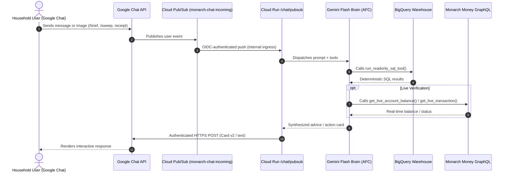

# Google Chat Financial Advisor (FinSage)

**FinSage** operates as an interactive Google Chat Bot supporting 1:1 direct messages and collaborative family chat spaces. Powered by **Gemini Flash**, it combines deterministic BigQuery analytical queries, real-time Monarch API lookups, multimodal computer vision, and Vertex AI long-term memory.

---

## 1. Private-Ingress Chat Architecture

FinSage connects to Google Chat without a public endpoint:

```mermaid
sequenceDiagram
    autonumber
    actor User as Household User (Google Chat)
    participant ChatAPI as Google Chat API
    participant PubSub as Cloud Pub/Sub (monarch-chat-incoming)
    participant Worker as Cloud Run /chat/pubsub
    participant Gemini as Gemini Flash Brain (AFC)
    participant BQ as BigQuery Warehouse
    participant Monarch as Monarch Money GraphQL

    User->>ChatAPI: Sends message or image (/brief, /sweep, receipt)
    ChatAPI->>PubSub: Publishes user event
    PubSub->>Worker: OIDC-authenticated push (internal ingress)
    Worker->>Gemini: Dispatches prompt + tools
    Gemini->>BQ: Calls run_readonly_sql_tool()
    BQ-->>Gemini: Deterministic SQL results
    opt Live Verification
        Gemini->>Monarch: Calls get_live_account_balance() / get_live_transaction()
        Monarch-->>Gemini: Real-time balance / status
    end
    Gemini-->>Worker: Synthesized advice / action card
    Worker->>ChatAPI: Authenticated HTTPS POST (Card v2 / text)
    ChatAPI-->>User: Renders interactive response
```

Chat events are delivered by a **Pub/Sub push subscription** (`monarch-chat-push`) to `/chat/pubsub`. The service accepts only internal traffic and verifies each request's OIDC token, so it has no public endpoint, and it scales to zero between messages. Answers that take longer than 12 seconds get an interim "Analyzing..." reply, and the full answer is posted to the thread before the push request is acknowledged.

The legacy streaming-pull worker (`app/chat_worker.py`) is still available by setting `ENABLE_CHAT_PULL_WORKER=true`, but it needs an always-on instance (`--min-instances 1 --no-cpu-throttling`), which bills a full vCPU around the clock.

---

## 2. Slash Commands Cheatsheet

| Command | Action Description | Primary Tools / Views Used |
| :--- | :--- | :--- |
| **`/brief`** | Shows today's summarized brief: recent activity, goal pacing, the most notable new findings, and 13-week trends. Viewing it on demand does not use up the next scheduled brief's findings. | `app/daily_brief.py`, `brief_history` |
| **`/alerts`** | Runs every spend alert check and replies in the thread with the full list, each with a 7-day snooze button. | `v_duplicate_charges`, `v_subscription_price_creep`, `v_annual_bill_radar` |
| **`/sweep`** | Evaluates checking liquidity to calculate safe surplus sweeps to high-rate debt. | `v_paycheck_surplus_allocation`, `v_annual_bill_radar` |
| **`/tax [YYYY]`** | Displays annual tax deductibility summary (Schedule C, HSA, Charities). | `v_tax_deductible_summary` |
| **`/digest [weekly\|monthly]`** | Generates an executive CFO performance briefing. | `v_debt_summary`, `v_spend_classification` |
| **`/sync`** | Triggers immediate Monarch Money ingestion into BigQuery. | `monarch_service.sync_accounts_to_bq()` |
| **`/receipt`** *(with image)* | Extracts line items, scrubs PII, classifies tax deductibility, and matches bank ledger. | Gemini Vision, `raw_transactions` |
| **`/help`** | Displays quick command reference and suggested natural language prompts. | Built-in |

---

## 3. Conversational Reasoning & Natural Language

Gemini automatically maps user intent to BigQuery analytical views using Automatic Function Calling (AFC):

* *"What is our daily debt interest cost across mortgage and HELOC right now?"*  
  → Queries `v_debt_summary` and reports total balance, daily carry, and mortgage vs HELOC breakdowns.
* *"Which subscriptions increased in price over the last year?"*  
  → Queries `v_subscription_price_creep` and advises on the exact annualized increase.
* *"How much did we spend on dining out vs groceries last month?"*  
  → Queries `v_food_efficiency` to compare grocery baseline vs dining markups.
* *"Where are our top micro-transaction leaks under $35?"*  
  → Queries `v_micro_transaction_leakage` for coffee shops and convenience spending.
* *"How much safe surplus can we sweep from checking to pay down debt today?"*  
  → Queries `v_paycheck_surplus_allocation` to determin## 4. Daily Brief (`/brief`) and Full Alert Scan (`/alerts`)

Every morning at 08:00 AM the `monarch-alerts-job` posts a short **daily brief** card. Ask for it any time with `/brief`, or in plain words (*"show me today's summary"*, *"daily brief"*). The card has four sections:

1. **Recent activity**: transactions in the past three days, the biggest one compared with what you usually spend at that merchant, and month-to-date spend against the same point last month.
2. **🎯 Goals**: spending caps and the HELOC payoff date read from long-term memory, with a progress bar and pacing, for example `██░░░░░░░░ $100 of $400 · ahead of pace`.
3. **🔍 Worth a look**: at most two findings, chosen by dollar impact from:
   * categories running well above the median of the prior three 4-week windows (or well below),
   * merchants visited about twice as often as usual,
   * first-ever merchants,
   * accounts that have stopped reporting transactions,
   * one-time alerts such as duplicate charges.

   Shown findings are recorded in `brief_history`. A trend is not repeated for 14 days, a stale account for 7, and a one-time alert for a year, so each day surfaces something new. A quiet day says so instead of repeating old items.
4. **📈 13-week trends**: weekly sparklines for your three largest spending categories, each with an up or down arrow.

Viewing the brief on demand does not record its findings, so it never uses up the next scheduled brief. On Mondays the job also posts the weekly digest.

**`/alerts`** is the exhaustive view: it runs every alert check and replies in the thread with each alert and a **7-day snooze button** (HMAC-SHA256 signed). `python -m app.job full-scan` posts the same alerts to the space together with the older synopsis (pacing thermometer, cash posture and debt carry), which is also available from the `/advisor/morning-brief` API.

---

by HMAC-SHA256 signatures.

---

## 5. Paycheck Surplus Sweep Engine (`/sweep`)

When payroll deposits arrive, `/sweep` protects essential cash reserves before accelerating debt paydown:
1. Calculates liquid checking balances.
2. Protects 30-day non-negotiable fixed overhead burn with a **15% safety buffer**.
3. Protects upcoming 30-day lump-sum bills (insurance, property tax) from `v_annual_bill_radar`.
4. Sweeps the safe surplus directly to the highest-rate liability (e.g. variable HELOC).
5. Displays immediate daily, monthly, and lifetime interest eliminated.

---

## 6. Multimodal Receipt & Tax Ingestion (`/receipt`, `/tax`)

Users can paste photos or PDFs of receipts and invoices directly into Google Chat:
1. **Gemini 2.5 Flash Vision**: Extracts merchant name, transaction date, total amount, sales tax, tip, and itemized line items.
2. **Zero-PII Scrubbing**: Deterministically redacts SSNs, EINs, and credit card PANs before saving to BigQuery.
3. **IRS Deductibility Analysis**: Evaluates items against IRS IRC §162 (Schedule C business expenses), IRC §213(d) (HSA/FSA medical expenses), and IRC §170 (501(c)(3) charitable donations).
4. **Asymmetric Bank Matcher**: Searches `raw_transactions` in a `[-3 days, +10 days]` window, accommodating delayed batch posting and restaurant tips up to +35%.
5. **Interactive Review Card**: Displays parsed data with one-click verification.

---

## 7. Guarded Mutations & Cryptographic Confirmation

When modifying categories or making ledger changes in Monarch Money, FinSage enforces physical confirmation:
* **Interactive Card v2 Confirmation Widget**: Shows transaction details, original category, and proposed new category.
* **Cryptographic Tamper Protection**: Action buttons include an HMAC-SHA256 signature containing transaction ID, category ID, and timestamp. Signatures expire in 15 minutes.
* **Audit Trail**: Every confirmed or canceled mutation is permanently recorded in BigQuery `mutation_audit_log`.

---

## 8. Vertex AI Long-Term Memory Bank

FinSage integrates with Vertex AI Agent Platform to persist family financial preferences across conversation threads:
* Remembers user-specific targets (e.g. *"Our dining goal is under $600/month"*, *"Prioritize paying off the HELOC before the auto loan"*).
* Resolves conflicting preferences autonomously.
* Injects consolidated financial rules directly into Gemini's reasoning context.
